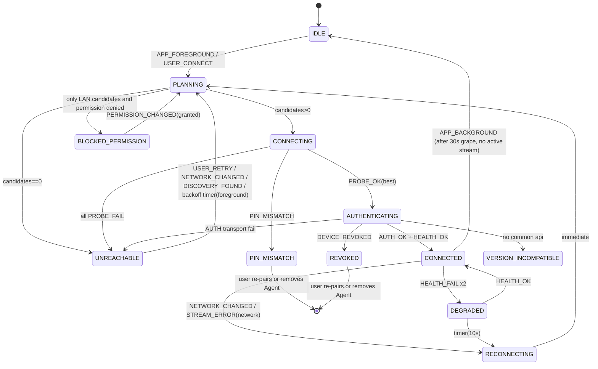
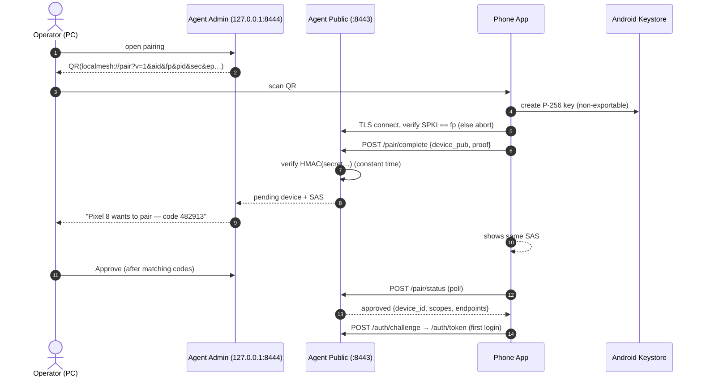
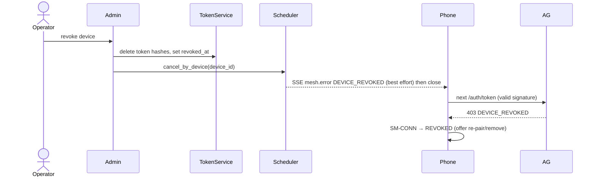

# LocalMesh AI — Architecture, Requirements & Agent Context Specification

| Field | Value |
|---|---|
| Document ID | `LM-ARCH-001` |
| Version | `1.0.0` (first complete draft) |
| Date | 2026-10-03 |
| Status | Baseline for implementation. Items tagged `OPEN` need a human decision (§24). |
| Audience | (1) The project owner. (2) AI coding agents implementing the system. |
| Inputs analysed | `info.docx`, `Executive_Summary.pdf`, `deep-research-report.md`, `Architecting_LocalMesh_AI…Feasibility_Study.md`, `Blueprint_for_a_Private_AI_Mesh…Feasibility_Analysis.md`, plus external verification done on 2026-10-03 (§6) |

---

## 0. How to use this document

**If you are a human:** read §4 (product), §8 (decisions), §9 (high-level design), §22 (roadmap). Everything else is reference.

**If you are a coding agent:** you MUST read §1 (Agent Operating Contract) before writing any code, then load only the *context bundle* for your work package from §22.3. Do not load the whole document into one task; do not work from memory of what "LM Studio" or "Ollama" APIs look like — use §6 and §13 only.

### 0.1 Reading order by purpose

| Purpose | Sections |
|---|---|
| Understand what we are building and why | §4, §5, §8 |
| Understand structure (HLD) | §9 |
| Build the desktop agent | §10, §13, §14, §17, §18 |
| Build the mobile app | §11, §13, §14, §15, §18 |
| Build the optional cloud control plane | §12, §17 |
| Fix a connection problem | §18 |
| Review security | §17 |
| Plan or estimate work | §7, §22, §23 |

---

## 1. Agent Operating Contract (READ FIRST — normative)

This section is binding on any AI coding agent. Keywords MUST / MUST NOT / SHOULD follow RFC 2119.

### 1.1 Source-of-truth precedence

When two statements conflict, the higher one wins:

1. **§8 Architecture Decisions (ADR-xxx)** — a decision, once `Accepted`, overrides everything below.
2. **§13 API contracts, §14 data models, §15 state machines** — exact wire/storage behaviour.
3. **§7 Requirements (FR/NFR/CON)** — what must be true.
4. **§10–§12 component designs, §16 algorithms** — how, unless contradicted above.
5. **Narrative text and examples** — illustrative only.
6. **Your own prior knowledge** — lowest. Never use it to override anything above.

### 1.2 Anti-hallucination rules

1. **Do not invent endpoints, fields, flags, CLI options, package names, or version numbers.** If a value is not in this document and not in the repository, it is unknown. Look it up in official documentation at implementation time, or write a `QUESTION-xxx` entry in `docs/OPEN_QUESTIONS.md` and stop that sub-task.
2. **Evidence tags are binding.** Every external fact in this document carries an evidence tag (§2.3). Treat `[SRC]`, `[UNVERIFIED]` and `[ASSUMPTION]` facts as *hypotheses to confirm with a test*, not as truth.
3. **Never "fix" a contract silently.** If an API/DB/state contract in this document seems wrong, open a change proposal (§1.5) — do not diverge in code.
4. **Never fabricate data at runtime.** If a backend does not report a model's context length, quantization, VRAM, etc., the value is `null` with `source:"unknown"` (see §13.5). Do not guess from the model name.
5. **Do not add dependencies** not listed in §21.2 without an ADR. Pin exact versions at M0 from the package registry; do not type versions from memory.
6. **Do not widen scope.** Anything not in the current milestone's scope (§22.1) is out of scope even if it appears elsewhere in this document.
7. **Stay inside the vocabulary** of §3. Do not introduce synonyms (e.g. "server" for Agent, "node" for Device).

### 1.3 Security non-negotiables (violating any = defect, block the merge)

- **SEC-N1** No cleartext HTTP on any non-loopback interface or in any release build. `android:usesCleartextTraffic="true"` MUST NOT appear in a release manifest.
- **SEC-N2** Inference backends (LM Studio, Ollama, others) MUST be reached only via loopback by the Agent. The Agent is the only network-exposed process.
- **SEC-N3** Prompts, model outputs, attachments and documents MUST NOT be written to Agent logs, crash reports, analytics, or the control plane.
- **SEC-N4** Network position (LAN or tailnet membership) is never authorization. Every non-pairing request needs a valid device token.
- **SEC-N5** Secrets (device private keys, TLS private key, backend API tokens) never leave their secure store and are never logged or placed in QR codes/URLs (the one-time pairing secret is the sole exception, §17.4).
- **SEC-N6** No `--insecure`/`DEV_MODE` flag may be enabled by default, and CI MUST fail a release build if dev-mode code paths are reachable (§21.4).

### 1.4 Working method

For every task: (1) restate the requirement IDs you are satisfying; (2) list the contracts you will touch; (3) write/adjust tests first or alongside (§21.5); (4) implement; (5) run the Definition of Done checklist (Appendix G); (6) report what you did **and what you did not verify**.

**Stop-and-ask conditions** — halt and write a `QUESTION-xxx` instead of proceeding when: a contract is ambiguous; two sections conflict at the same precedence level; a required external API detail is `[UNVERIFIED]` and cannot be confirmed by a test against a real or recorded backend; a change would weaken a SEC-N rule; the task needs a dependency/ADR not yet approved.

### 1.5 Change protocol

Contract or decision change = (a) edit the relevant ADR/contract section with a new revision note, (b) regenerate the OpenAPI/types (§21.3), (c) update affected tests, (d) bump `Document version` minor. Code that changes a contract without a doc change is rejected.

### 1.6 Output discipline

Small, reviewable diffs. One work package (WP) per branch. Conventional commit messages that cite IDs: `feat(agent): SSE chat stream [FR-CHAT-01, API-CHAT-01]`.

---

## 2. Document conventions

### 2.1 ID scheme

| Prefix | Meaning | Prefix | Meaning |
|---|---|---|---|
| `FR-xxx-nn` | Functional requirement | `ADR-nnn` | Architecture decision |
| `NFR-xxx-nn` | Non-functional requirement | `API-xxx-nn` | Endpoint contract |
| `CON-nn` | Constraint | `SM-xxx` | State machine |
| `SEC-nn` / `SEC-Nn` | Security control / non-negotiable | `CI-nn` | Connection issue (§18) |
| `WP-nn` | Work package | `R-nn` | Risk |
| `TC-xxx-nn` | Test case | `Q-nn` | Open question |

### 2.2 Priorities & milestones

`P0` = required for MVP; `P1` = required for v1.0; `P2` = post-v1. Milestones `M0…M9` are defined in §22.1. Every requirement lists the milestone that must deliver it.

### 2.3 Evidence legend

| Tag | Meaning | How to treat |
|---|---|---|
| `[VERIFIED 2026-10-03]` | Confirmed against current public documentation during authoring of this document | Safe to implement; still re-check if the doc is >90 days old |
| `[SRC]` | Stated in one or more of the 5 input files, not independently verified | Confirm by test before relying |
| `[DESIGN]` | A decision made in this document | Binding once its ADR is Accepted |
| `[ASSUMPTION]` | Reasonable belief, no evidence | Confirm or replace; never build critical logic on it |
| `[UNVERIFIED]` | Seen in a source but contradicted, version-dependent, or implausible | Do not implement from it; verify first |

---

## 3. Glossary (canonical vocabulary — use exactly these terms)

| Term | Definition | Do NOT call it |
|---|---|---|
| **Mesh** | The set of a user's own Devices that can reach each other privately | cloud, network |
| **Device** | Any paired endpoint holding a device keypair: a **Phone** or an **Agent host** | node, client machine |
| **Phone** | Android device running the **App** | mobile client (ok in prose), handset |
| **App** | The LocalMesh React Native application on the Phone | client app |
| **Agent** | LocalMesh Desktop Agent: the service on the PC; the only network-exposed process; exposes the **Mesh API** | server, daemon, gateway, proxy |
| **Backend** | A local inference engine the Agent talks to over loopback (LM Studio, Ollama, llama.cpp server, any OpenAI-compatible server) | engine, provider |
| **Mesh API** | The versioned HTTPS API the Agent exposes at `/mesh/v1` | LocalMesh API, REST API |
| **Control Plane** | The OPTIONAL cloud service for identity + device registry. Never carries content | backend (ambiguous!), server |
| **Content** | Prompts, completions, attachments, documents, transcripts, retrieved passages | data, payload |
| **Metadata** | Non-content facts: device names, public keys, online status, timings, token counts | — |
| **Pairing** | One-time out-of-band establishment of trust between Phone and Agent | linking, registration |
| **Pairing Secret** | One-time high-entropy secret carried in the QR code | password, PIN |
| **Device Token** | Short-lived opaque bearer token issued to a paired Device after proof of key possession | session, JWT |
| **Transport Tier** | How packets reach the Agent: `T0` LAN direct, `T1` LAN via mDNS name, `T2` Tailnet, `T3` Relay/P2P (future) | route, path |
| **Endpoint** | A concrete `https://host:port` the App can try for an Agent | URL (ambiguous) |
| **Tailnet** | The user's Tailscale private network | VPN (generic) |
| **Capability Registry** | The Agent's normalized list of Models with metadata and provenance | model list |
| **Model** | An inference model made available by a Backend, identified by `mesh_model_id` | LLM (too narrow) |
| **mesh_model_id** | `"<backend_id>::<backend_model_id>"` | model name |
| **Request** | One inference call identified by `request_id` | job (jobs are durable Tasks, P1) |
| **Task** | A durable, asynchronous unit of work (P1; vision/voice/docs) | request |
| **TTFT** | Time to first token, measured at the Agent and at the App | latency (ambiguous) |
| **SAS** | Short authentication string: 6 digits shown on both Phone and PC during pairing | PIN |
| **Connection Manager** | App component that selects/maintains the Endpoint per Agent (SM-CONN) | network layer |
| **Doctor** | Diagnostic routine in App and Agent CLI that explains why a connection fails (FR-CONN-06) | troubleshooter |

---

## 4. Product definition

### 4.1 One-sentence definition

LocalMesh AI is a **privacy-first control plane and secure transport** that lets an Android phone discover, pair with, and use AI models running on the user's own PCs — on the same Wi-Fi or from anywhere — without any prompt ever passing through a third party's servers in readable form.

### 4.2 Why this and not "another LM Studio client"

`[SRC]` Android clients for LM Studio/Ollama already exist (LMSA, LMSMOB Chat, Kollama, Tellama; `info.docx`, `deep-research-report.md`); LM Studio itself ships LM Link + the iOS app "Locally" using Tailscale (`info.docx`, `Executive_Summary.pdf`). A plain chat client is therefore not differentiated. Differentiators to build, in priority order:

1. **Agent-mediated abstraction** — one Mesh API in front of many Backends (LM Studio, Ollama, llama.cpp…), with a normalized Capability Registry.
2. **Zero-configuration connectivity** — LAN discovery + automatic fallback to a private tunnel; the user never types an IP once paired; a Doctor explains failures.
3. **Verifiable privacy** — explicit Content/Metadata separation, pinned TLS everywhere, no content in any cloud component.
4. **Orchestration** — hardware-aware, capability-aware model routing; multimodal and agent services later.

### 4.3 Users & primary use cases

| Persona | Need |
|---|---|
| Privacy-conscious AI user | Use their own GPU models from a phone anywhere |
| Developer / hobbyist | Run Qwen/Llama/etc. locally, chat from mobile, later automate |
| Student / researcher | Heavy model at home, phone as thin UI |
| Small office | Share one capable PC's models across a few phones |

| UC | Use case |
|---|---|
| UC-1 | At home: open App → "Connected via LAN" → chat with a model on the PC |
| UC-2 | Away: same App, same tap; connection silently uses the Tailnet |
| UC-3 | Pair a new Phone by scanning a QR shown on the PC |
| UC-4 | See each PC's online status, loaded models, tokens/sec, GPU/VRAM |
| UC-5 | Lose a Phone → revoke it from the PC; it loses access immediately |
| UC-6 (P1) | Send a photo/voice note/PDF to be processed by PC-side vision/Whisper/RAG |
| UC-7 (P1/P2) | Long task finishes while app is backgrounded → notification |

### 4.4 Scope

**In scope:** Android App; Desktop Agent (Windows + Linux P0, macOS P1 `OPEN Q-01`); Mesh API; pairing/auth; LAN discovery; Tailnet-based remote access; Backend adapters (LM Studio, Ollama, generic OpenAI-compatible); model registry & metrics; local encrypted chat history; optional Control Plane (P1/P2).

**Non-goals (explicitly out of scope — do not build):**

- Hosting models in the cloud, multi-tenant SaaS, billing, public-internet exposure of the Agent. `[SRC]` info.docx §29 notes the public multi-user variant needs a different architecture; it is not this product.
- Running LLM inference on the phone as the primary mode (an offline on-device fallback is P2 and only a stub in v1).
- Replacing LM Studio/Ollama as inference engines.
- iOS app (architecture allows it later; no work now).
- Cloud sync of conversations. Chat history lives on the Phone only.
- Custom VPN/relay implementation in v1 (Tier T3 is designed-for, not built; ADR-005).
- Agent tool execution on the PC (browser automation, file ops, shell) before M8 and before a dedicated security ADR.

### 4.5 Constraints

| ID | Constraint |
|---|---|
| CON-01 | **Zero mandatory recurring cost.** Every mandatory component is OSS or has a permanent free tier. Paid items may only be optional. (Note: store-listing fees, if the owner chooses Play Store, are a one-time owner decision — `OPEN Q-09`.) |
| CON-02 | **Privacy:** Content never reaches any cloud component, including the Control Plane and any relay, in readable form. |
| CON-03 | **OSS-first:** prefer permissively licensed dependencies; license of the project itself is `OPEN Q-08`. |
| CON-04 | **Android first.** Technology choices must not preclude iOS later. |
| CON-05 | **Small team / single developer scale:** minimize moving parts; prefer boring, well-documented tech. |

---

## 5. Source reconciliation (what the 5 inputs disagree on, and what we decided)

The inputs were written independently (several are AI-generated research). They disagree. This table is the authoritative resolution; ADR numbers point to §8.

| # | Topic | What the sources say | Resolution |
|---|---|---|---|
| S-1 | **Mobile stack** | Kotlin + Jetpack Compose: `Executive_Summary.pdf`, `info.docx` (recommended for polish), `Blueprint…`. React Native (+Expo): `Architecting…`. Flutter/RN as alternatives: `info.docx`. | **React Native (TypeScript) UI + a thin native Kotlin module for security/transport-critical code** (ADR-003). Native Kotlin+Compose remains the documented fallback. |
| S-2 | **Streaming protocol** | WebSocket (`Executive_Summary`); SSE (`Blueprint`, `info.docx`, `Architecting`); either (`info.docx`). | **SSE** for tokens + explicit cancel endpoint (ADR-004). WebSocket not used in v1. |
| S-3 | **Remote access** | WebRTC/STUN/TURN or custom relay with app-layer AES-GCM (`Executive_Summary`); Tailscale first, custom mesh later (`info.docx`, `deep-research`, `Architecting`, `Blueprint`). | **Tailscale for v1 (Tier T2)**; transport abstracted so T3 can be added later (ADR-005). Cloudflare Tunnel rejected (terminates TLS at provider — conflicts with CON-02, per `Architecting`/`deep-research`). |
| S-4 | **Tailscale free-tier limits** | "10 free nodes" (`Executive_Summary`); "6 users, unlimited devices" (`Architecting`); "100 devices" (`Blueprint`). External check: older pages say 3 users / 100 devices; Aug-2026 pages say 6 users / unlimited user devices after an April-2026 pricing change. | **Do not hard-code any limit.** `[UNVERIFIED]` — owner must check tailscale.com/pricing (Q-03). No code may depend on it. |
| S-5 | **Crypto stack** | OAuth + ECDH + AES-256-GCM over TLS (`Executive_Summary`); SPAKE2+ → mTLS → Noise XX → Peer DIDs (`Blueprint`); Google code-exchange via BaaS (`Architecting`); QR pairing + Google identity (`info.docx`). | **Layered minimal stack (ADR-006/007/008):** pinned self-signed TLS 1.3 + QR one-time-secret pairing + per-device ECDSA key + opaque tokens. SPAKE2+ only for the optional manual-code pairing (P2). Noise/AES-GCM app layer only if T3 relay is built. Peer DIDs and mTLS deferred (no consumer, high cost). |
| S-6 | **Central registry vs local** | A cloud "Device Registry & Signaling + Model Orchestrator" in the data path (`Executive_Summary` diagrams). | **Agent-local data plane.** Control Plane is optional, metadata-only, and never in the content path (ADR-001, ADR-010). The Agent enforces authorization offline. |
| S-7 | **LM Studio API surface** | `Executive_Summary` cites WebSocket "streaming events", `/v1/list_models`, `/v1/load_model`. | `[UNVERIFIED]` and contradicted by current docs (§6). Use §6 endpoints only. |
| S-8 | **Competitor facts** | `Executive_Summary` table lists LMSA as "no known" Android support. `info.docx` and `deep-research` state LMSA is an Android app with LAN + custom endpoints (and Tailscale remote). | Treat LMSA as an existing Android competitor. (Informational only; no design impact.) |
| S-9 | **Cleartext HTTP** | `Architecting`, `Blueprint`, `info.docx` suggest setting `usesCleartextTraffic="true"` for LAN. | **Rejected for release** (SEC-N1). Agent serves pinned TLS on LAN. A debug-only, loopback/emulator exception is allowed (§17.9). |
| S-10 | **Where the "intelligence" runs** | Central orchestrator (`Executive_Summary`); Agent-side router with classifier model (`Blueprint`, `info.docx`, `Architecting`). | **Agent-side router**, rule-based first (M5/M8), classifier experimental (ADR-013). LiteLLM used as a *reference*, not a dependency (supply-chain concern, `Blueprint`). |
| S-11 | **Where Google fits** | Identity only, not transport (`info.docx`, `Blueprint`, `Architecting`, `Executive_Summary`). | **Agreed.** Google Sign-In = identity for the optional Control Plane only. v1 pairing and operation need no Google account (ADR-010). |
| S-12 | **Agent language** | Python/FastAPI first, Go/Rust later (`info.docx`, `Architecting`, `Blueprint`). | **Agreed:** Python 3.12 + FastAPI first; hexagonal structure keeps a Go/Rust port feasible (ADR-002). |
| S-13 | **Speech/voice endpoints in LM Studio** | `Executive_Summary` says LM Studio exposes a Whisper audio endpoint. | `[UNVERIFIED]`. Plan a separate Whisper-service adapter (P1); do not assume LM Studio provides STT. |

---

## 6. Verified external facts (checked 2026-10-03) and known-unknowns

Re-verify any item older than 90 days. "Contract test" = a test with recorded real responses (§21.5) that MUST exist before the adapter is considered done.

### 6.1 LM Studio `[VERIFIED 2026-10-03]` unless noted

| Fact | Detail |
|---|---|
| Native REST API | Since LM Studio 0.4.0, the recommended native API is `/api/v1/*`: `POST /api/v1/chat`, `GET /api/v1/models`, `POST /api/v1/models/load`, `POST /api/v1/models/unload`, `POST /api/v1/models/download`, `GET /api/v1/models/download/status`. |
| Legacy API | A `v0` REST API (`/api/v0/*`) existed earlier and is superseded. **Do not build on `/api/v0`.** |
| OpenAI-compatible | `GET /v1/models`, `POST /v1/chat/completions` (not `/api/v1/chat/completions`), plus `/v1/responses`, embeddings; Anthropic-compatible `/v1/messages`. |
| Streaming | Supported on `/api/v1/chat` and OpenAI-compatible endpoints. (OpenAI-compatible streaming is SSE.) |
| Auth | The native `/api/v1` server can be configured to require a bearer API token; default accepts unauthenticated local requests. |
| Default port | `1234` `[SRC]` (consistent across sources). |
| Network serving | LM Studio has a "serve on local network" setting. **LocalMesh does not need it** — the Agent talks to LM Studio on loopback (SEC-N2). |
| LM Link / Locally | LM Link (Tailscale-based) and the iOS app Locally exist `[SRC]`; not an Android solution. |
| **Unknown** | Exact JSON field names of `/api/v1/models` (context length, quantization, loaded state, capabilities). `[UNVERIFIED]` → adapter MUST be written against recorded real responses and tolerate missing fields. |
| **Unknown** | Whether LM Studio offers any speech-to-text endpoint. `[UNVERIFIED]`. |

### 6.2 Ollama `[VERIFIED 2026-10-03]` unless noted

| Fact | Detail |
|---|---|
| Port / bind | `11434`; bind address set by `OLLAMA_HOST`. |
| **No authentication** | The Ollama API has no auth. Exposing it beyond loopback is dangerous → Agent MUST warn if it detects non-loopback binding (FR-AGT-06). |
| Native endpoints | `GET /api/tags` (models on disk), `GET /api/ps` (models in memory, incl. VRAM footprint), `POST /api/show` (details incl. context length, quantization), `POST /api/chat` and `POST /api/generate` (stream by default), `POST /api/pull`. |
| OpenAI-compatible | `/v1/chat/completions`, `/v1/completions`, `/v1/models`, `/v1/embeddings`, `/v1/responses`. |
| Keep-alive | `keep_alive` parameter on `/api/generate` and `/api/chat` (`-1` never unload, `0` unload now, durations like `"10m"`); `OLLAMA_KEEP_ALIVE` env default; default idle unload ≈ 5 min `[SRC]`. |
| Concurrency | `OLLAMA_NUM_PARALLEL`, `OLLAMA_MAX_QUEUE`, `OLLAMA_MAX_LOADED_MODELS` `[SRC]`. |
| **Unknown** | Whether `keep_alive` is honored on the `/v1/chat/completions` path. `[UNVERIFIED]` → preload/keep-warm via native `/api/chat` or `/api/generate` with an empty prompt. |

### 6.3 Tailscale

| Fact | Detail |
|---|---|
| Encryption | WireGuard-based; traffic encrypted end-to-end between devices, relay (DERP) fallback sees only ciphertext `[SRC]`. |
| Addressing | Tailnet IPs in `100.64.0.0/10` (shown as `100.x.x.x`) `[SRC]`; MagicDNS names `<host>.<tailnet>.ts.net` `[ASSUMPTION — verify exact naming]`. |
| Free plan | **Limits disagree across sources (S-4).** `[UNVERIFIED]`; as of Aug-2026 third-party pages: Personal = free, up to 6 users, unlimited user devices. Owner must confirm (Q-03). |
| Android constraint | Android permits **one active VPN at a time**; Tailscale on Android is a VPN `[ASSUMPTION — well-known Android behaviour; verify in test]`. |
| CLI | `tailscale status --json` is expected to expose `BackendState`, `Self.TailscaleIPs`, `Self.DNSName` `[ASSUMPTION — verify against installed version]`. |
| What the App cannot do | Do not assume the App can start/stop Tailscale or read its state beyond OS-level VPN/network signals. Guide the user (CI-13, CI-14). |

### 6.4 Android platform `[VERIFIED 2026-10-03]`

| Fact | Detail |
|---|---|
| **Local network permission** | Android 16: opt-in protection using `NEARBY_WIFI_DEVICES`. **Android 17 (target SDK 37):** mandatory; apps targeting 37+ are blocked from local-network traffic by default and must declare and request the runtime permission `ACCESS_LOCAL_NETWORK`. Apps targeting <37 get an implicit grant if they hold `INTERNET`. Do not request `ACCESS_LOCAL_NETWORK` at runtime before targeting SDK 37. |
| What is covered | Traffic to/from local-network addresses; mDNS and SSDP; resolving `.local` names. |
| System-mediated discovery | `NsdManager` offers a system service picker (`DiscoveryRequest.FLAG_SHOW_PICKER`) usable without the permission; `registerServiceInfoCallback`/`resolveService` give addresses. |
| Consequence | Local-network access is a **first-class connection-failure cause** (CI-09). The Connection Manager MUST model permission state. |
| Cleartext | Cleartext HTTP is blocked by default (since Android 9) `[SRC]` — we avoid it entirely (SEC-N1). |
| Emulator | The host loopback from an Android emulator is `10.0.2.2` `[ASSUMPTION — standard; verify]`. |

### 6.5 Libraries `[UNVERIFIED]` — verify at M0

`react-native-zeroconf`, `react-native-sse`, `expo/fetch` streaming, SQLCipher binding (`op-sqlite` / alternatives), `python-zeroconf`, `pynvml`, `psutil`. Their maintenance status, Android 17 compatibility, and API surface are NOT established here. M0 includes a dependency spike (WP-02) whose output replaces this row.

---

## 7. Requirements

Columns: **Pri** priority (§2.2), **M** delivering milestone, **AC** acceptance criteria (testable), **Src** origin.

### 7.1 Functional requirements

#### Pairing & identity (FR-PAIR)

| ID | Requirement (shall) | Pri | M | AC | Src |
|---|---|---|---|---|---|
| FR-PAIR-01 | The Agent shall show a pairing QR only while the PC operator has explicitly opened Pairing Mode in the loopback admin UI/CLI | P0 | M2 | QR endpoint returns 409 `PAIRING_CLOSED` when closed; no remote way to open | DESIGN |
| FR-PAIR-02 | Pairing Secret ≥ 128-bit CSPRNG, single-use, TTL default 300 s (configurable ≤ 600 s) | P0 | M2 | Second use of same secret → 403; use after TTL → 410 | DESIGN |
| FR-PAIR-03 | The App shall verify the Agent TLS leaf SPKI SHA-256 against the QR `fp` before sending any secret-derived value | P0 | M2 | Pin mismatch aborts pairing with no request body sent (verified by test server) | DESIGN |
| FR-PAIR-04 | The Agent shall require operator confirmation on the PC showing a 6-digit SAS that matches the Phone (default ON; configurable) | P0 | M2 | Without confirm within 120 s → pairing fails, secret consumed | DESIGN |
| FR-PAIR-05 | Device private keys shall be generated on the Phone in hardware-backed Android Keystore, non-exportable | P0 | M2 | Key `isInsideSecureHardware` true where hardware exists; export impossible by API | DESIGN |
| FR-PAIR-06 | The operator shall be able to revoke a Device; revocation takes effect ≤ 5 s including aborting that Device's active streams | P0 | M2 | Test: revoke during stream → stream ends with `DEVICE_REVOKED`; next token request 401/403 | `info.docx` |
| FR-PAIR-07 | Manual-code pairing (no camera) using SPAKE2+ | P2 | M9 | RFC-conformant test vectors pass; 5 failed attempts → lockout | `Blueprint` |

#### Connectivity (FR-CONN)

| ID | Requirement | Pri | M | AC | Src |
|---|---|---|---|---|---|
| FR-CONN-01 | App stores per paired Agent: pin, device_id, and an ordered list of known Endpoints | P0 | M2 | Survives app restart | DESIGN |
| FR-CONN-02 | Connection Manager selects Endpoints by tier with staggered racing and verification (ADR-012, SM-CONN) | P0 | M3/M4 | Deterministic simulation tests pass (§16.1) | `info.docx` §17 |
| FR-CONN-03 | App shows current tier (LAN / Tailnet / Relay) and state in the chat and device screens | P0 | M3 | UI snapshot test per state | `Executive_Summary` |
| FR-CONN-04 | On OS network change, App re-evaluates the connection and (if idle) re-establishes within 3 s target | P1 | M4 | Instrumented test toggling Wi-Fi/cell | DESIGN |
| FR-CONN-05 | LAN discovery via mDNS service `_localmesh._tcp` with manual-entry and QR-endpoint fallbacks | P0 | M3 | Discovery works on test LAN; falls back when multicast blocked | all sources |
| FR-CONN-06 | **Doctor**: App and `localmesh-agent doctor` run ordered checks and output actionable fixes mapped to CI-nn IDs | P1 | M3 | Each CI in §18.2 with "detect" column has a check or documented manual step | DESIGN |
| FR-CONN-07 | App models Android local-network permission state (A16 `NEARBY_WIFI_DEVICES`, A17 `ACCESS_LOCAL_NETWORK`) and guides the user | P0 | M3 | Denied permission yields CI-09 UX, not a generic timeout | §6.4 |
| FR-CONN-08 | Cooperating with Tailscale: Agent reports its Tailnet addresses; App shows guidance when Tailnet unreachable | P1 | M4 | `GET /device` includes `tailnet` block when detected | `Architecting` |

#### Models & registry (FR-MOD)

| ID | Requirement | Pri | M | AC | Src |
|---|---|---|---|---|---|
| FR-MOD-01 | Agent autodetects Backends on loopback (probe LM Studio `1234`, Ollama `11434`) and supports user-configured generic OpenAI-compatible Backends | P0 | M1 | Fake backends detected in integration tests | `Blueprint` |
| FR-MOD-02 | Agent exposes a normalized Capability Registry; unknown fields are `null` with provenance (§13.5) | P0 | M1 | Schema test: never emits guessed values | DESIGN |
| FR-MOD-03 | App lists Agents → Models with state (loaded/unloaded/loading/unknown) | P0 | M2 | Matches Agent response | `info.docx` |
| FR-MOD-04 | Load/unload exposed only when the Backend adapter declares support (LM Studio native load/unload `[VERIFIED]`) | P1 | M5 | Unsupported → 501 `UNSUPPORTED_CAPABILITY` | `deep-research` |
| FR-MOD-05 | Keep-warm policy per Backend (e.g. Ollama keep-alive) | P1 | M5 | Cold-start TTFT reduced vs baseline in benchmark | `Architecting` |

#### Chat (FR-CHAT)

| ID | Requirement | Pri | M | AC | Src |
|---|---|---|---|---|---|
| FR-CHAT-01 | Streaming chat over SSE, OpenAI-style chunks (+ mesh events) per API-CHAT-01 | P0 | M2 | Tokens render incrementally; contract test passes | `Blueprint` |
| FR-CHAT-02 | Stop generation cancels the upstream Backend request within 2 s | P0 | M2 | Backend fake observes abort ≤ 2 s | `Architecting` |
| FR-CHAT-03 | History stored only on the Phone, encrypted at rest; export to JSON and Markdown | P0 | M2 | DB file unreadable without key; export round-trips | `Executive_Summary` |
| FR-CHAT-04 | The Agent is stateless for chat: it MUST NOT persist Content (ADR-011) | P0 | M2 | Test greps Agent data dir & logs after chat for canary strings: none | DESIGN |
| FR-CHAT-05 | Pass-through of allow-listed sampling params only (§13.6) | P0 | M2 | Unknown params rejected 422 | DESIGN |
| FR-CHAT-06 | Interrupted streams keep partial text, are marked `interrupted`, and offer Regenerate | P0 | M2 | Kill connection mid-stream test | `Architecting` |
| FR-CHAT-07 | UI batches token renders at 50–100 ms; applies full Markdown only on completion (code blocks may render incrementally) | P1 | M2 | Frame-time budget test | `Architecting` |

#### Status & metrics (FR-STAT)

| ID | Requirement | Pri | M | AC |
|---|---|---|---|---|
| FR-STAT-01 | `GET /device` returns best-effort CPU/RAM/GPU/VRAM/OS; unavailable fields `null` | P1 | M5 | Works with no GPU; no exceptions |
| FR-STAT-02 | Per-request stats (TTFT, tokens out, tokens/s, duration) emitted in `mesh.stats` | P0 | M2 | Present on every completed stream |
| FR-STAT-03 | Queue depth and busy state in `GET /health` and `mesh.meta` | P1 | M5 | Visible under load test |

#### Multimodal, tasks, routing (P1/P2)

| ID | Requirement | Pri | M |
|---|---|---|---|
| FR-MM-01 | Image input to vision-capable Models | P1 | M7 |
| FR-MM-02 | Voice note transcription via a Whisper-class adapter (separate service) | P1 | M7 |
| FR-MM-03 | Document upload + embedding + retrieval (RAG) on the Agent host | P1 | M7 |
| FR-MM-04 | Durable Tasks with polling and local notification on completion | P1 | M7 |
| FR-RTE-01 | Rule-based routing by modality/capability/context fit (`model:"auto"`) | P1 | M8 |
| FR-RTE-02 | Hardware-aware scoring (warmth, queue, memory fit) across Backends/Agents | P2 | M8 |
| FR-RTE-03 | Classifier-model intent routing (experimental, off by default) | P2 | M8 |
| FR-AGENT-RT | Agent runtime / tool calling on the PC | P2 | M8, requires security ADR |

#### Control Plane (optional) (FR-CP)

| ID | Requirement | Pri | M |
|---|---|---|---|
| FR-CP-01 | Google Sign-In as identity only | P2 | M6 |
| FR-CP-02 | Device registry (metadata only) and last-seen | P2 | M6 |
| FR-CP-03 | Revocation mirror (Agent remains authoritative) | P2 | M6 |
| FR-CP-04 | Control Plane stores zero Content, enforced by schema and review | P2 | M6 |

#### Agent operations (FR-AGT)

| ID | Requirement | Pri | M |
|---|---|---|---|
| FR-AGT-01 | CLI `localmesh-agent` with `run`, `doctor`, `pair`, `devices`, `revoke`; install as OS service | P0 | M1/M2 |
| FR-AGT-02 | Loopback-only admin interface (separate listener) for pairing QR, device list, status | P0 | M2 |
| FR-AGT-03 | TOML config file with documented keys (Appendix E) | P0 | M1 |
| FR-AGT-04 | Advertise `_localmesh._tcp` via mDNS on selected interfaces only | P0 | M3 |
| FR-AGT-05 | Windows installer adds firewall rule for the Agent port scoped to Private profiles | P1 | M9 |
| FR-AGT-06 | Warn if a detected Backend is bound to a non-loopback address without auth | P1 | M5 |

### 7.2 Non-functional requirements

| ID | Category | Requirement | Pri |
|---|---|---|---|
| NFR-SEC-01 | Security | No cleartext on non-loopback; TLS 1.3 only on the Mesh API | P0 |
| NFR-SEC-02 | Security | Content never in logs; log field allow-list (§20) | P0 |
| NFR-SEC-03 | Security | Backends reached only via loopback; Agent warns otherwise | P0 |
| NFR-SEC-04 | Security | Secrets only in Keystore/OS keyring/0600 files (§17.6) | P0 |
| NFR-SEC-05 | Security | Auth endpoints rate-limited; pairing endpoints lock out after repeated failure | P0 |
| NFR-PRIV-01 | Privacy | Control Plane retains zero Content | P0 |
| NFR-PRIV-02 | Privacy | No analytics/telemetry by default; any telemetry opt-in, Metadata only | P0 |
| NFR-PERF-01 | Performance | Agent-added latency p95 ≤ 25 ms on LAN excluding Backend time `[DESIGN target]` | P1 |
| NFR-PERF-02 | Performance | TTFT targets (excl. cold model load): < 1 s small prompts on LAN, < 5 s over Tailnet `[SRC: Executive_Summary]` | P1 |
| NFR-PERF-03 | Performance | Streaming flows without proxy buffering; first byte flushed immediately | P0 |
| NFR-REL-01 | Reliability | Agent survives Backend restarts with exponential backoff + jitter | P0 |
| NFR-REL-02 | Reliability | Any mid-stream failure ends with a terminal `mesh.error` or clean close, never a hang (idle timeout 45 s) | P0 |
| NFR-COMP-01 | Compatibility | Chat request is a strict subset of OpenAI `chat/completions` plus `x_mesh` | P0 |
| NFR-COMP-02 | Compatibility | URL-versioned API (`/mesh/v1`); semantic version in `GET /info` | P0 |
| NFR-PLAT-01 | Platform | Agent: Windows 10/11 and Linux P0; macOS P1. App: Android minSdk 29 `[DESIGN]`, targetSdk per §6.4 | P0 |
| NFR-USE-01 | Usability | First pairing ≤ 60 s typical; no networking jargon in primary UI | P1 |
| NFR-MAINT-01 | Maintainability | Contract-first CI: OpenAPI generated from code is diffed against the committed spec | P0 |
| NFR-TEST-01 | Quality | Auth, pairing, connection manager, crypto modules ≥ 90 % line coverage | P1 |
| NFR-COST-01 | Cost | Satisfies CON-01 | P0 |

### 7.3 Traceability (high level)

| Requirement group | Primary components | Primary tests |
|---|---|---|
| FR-PAIR, NFR-SEC | `agent/security`, `mesh-core` (Kotlin), `features/pairing` | TC-PAIR-*, TC-SEC-* |
| FR-CONN | `agent/adapters/mdns`, App `ConnectionManager`, `mesh-core` | TC-CONN-*, network matrix §21.5 |
| FR-MOD, FR-CHAT | `agent/adapters/*`, `agent/api/v1`, App `features/chat` | TC-MOD-*, TC-CHAT-* |
| FR-STAT | `agent/adapters/hardware`, `observability` | TC-STAT-* |

---

## 8. Architecture decisions (ADR log)

Format: **Context → Decision → Consequences → Alternatives rejected**. All `Accepted` unless stated.

### ADR-001 — Three planes: Phone ↔ Agent data plane; optional Control Plane
- **Context:** Sources diverge on whether a cloud registry sits in the path (S-6).
- **Decision:** All Content flows only Phone ↔ Agent over the Mesh API. The Control Plane (cloud) is optional, holds Metadata only, and the Agent authorizes requests locally with no cloud dependency.
- **Consequences:** v1 works with zero cloud services; Control Plane failure cannot break chat; revocation must be enforced locally first.
- **Rejected:** central orchestrator in the data path (`Executive_Summary`) — violates CON-02 and adds a single point of failure.

### ADR-002 — Agent: Python 3.12 + FastAPI, hexagonal; Go/Rust later
- **Decision:** `uvicorn` + FastAPI + `httpx` (async) + Pydantic v2; core domain independent of frameworks (ports & adapters, §10). A later Go/Rust rewrite replaces adapters/API layer only.
- **Consequences:** fast iteration with Python AI tooling; larger install footprint until the rewrite.
- **Rejected:** LiteLLM as the Agent (rapid release cadence, supply-chain incidents, basic open-source auth — `Blueprint`); used as reference for routing ideas only.

### ADR-003 — App: React Native (TypeScript) + Expo dev-client; security/transport in a Kotlin native module
- **Context:** Sources split (S-1). TLS pinning with *dynamically paired* self-signed certs, Keystore-backed signing, mDNS under Android 17 rules, and streaming SSE with cancel are all awkward or unreliable in pure JS.
- **Decision:** UI, state, persistence orchestration in TS. A local Expo module `mesh-core` (Kotlin, OkHttp-based) owns: Keystore keys/signing, pinned-TLS HTTP + SSE streaming, mDNS/NSD, network-change signals, local-network permission. The JS layer never sees private keys and never performs raw network I/O to Agents.
- **Consequences:** Native code to maintain, but the security-critical surface is small, typed, and testable; keeps iOS option (a Swift `mesh-core` later).
- **Rejected:** pure-JS `fetch`+polyfills (jank, no custom trust); Kotlin+Compose full native (valid alternative if owner prefers: swap §11 only).

### ADR-004 — Streaming: SSE + cancel endpoint
- **Decision:** `text/event-stream` carrying OpenAI-style chunks; named `mesh.*` events for metadata; `: ping` keepalive every 15 s; cancel via client disconnect **and** `DELETE /mesh/v1/requests/{id}`.
- **Consequences:** works with HTTP tooling; unidirectional matches the data flow; no WebSocket backpressure code.
- **Rejected:** WebSocket (`Executive_Summary`) — needs manual backpressure; bidirectionality unnecessary.

### ADR-005 — Remote access: Tailscale (T2) first; transport abstraction for T3 later
- **Decision:** The App/Agent speak HTTPS to an *Endpoint*; they are agnostic to whether that is LAN or Tailnet. Remote support in v1 = user installs Tailscale on both devices (same tailnet). The Agent detects/reports its Tailnet name/IPs. A pluggable `Transport` interface is defined (§11.4, §16.1) so a future WebRTC/relay tier (T3) can be added without touching chat/pairing code.
- **Consequences:** zero infra; depends on a third-party coordination service and Android's one-VPN limit (CI-14).
- **Rejected:** Cloudflare Tunnel/ngrok (provider sees plaintext → CON-02); port forwarding (unsafe); WebRTC+TURN in v1 (≈65 % hole-punch success per libp2p measurement `[SRC: Blueprint]` ⇒ mandatory relay infra, cost); Headscale kept as an *optional* self-hosted coordinator the user may point Tailscale clients to (no code change).

### ADR-006 — Channel security: pinned self-signed TLS 1.3 on every path
- **Decision:** The Agent generates a self-signed ECDSA P-256 certificate at first run. Trust = SPKI pin learned from the pairing QR, not the CA system. TLS 1.3 only. Used on LAN *and* Tailnet for uniformity (the Tailnet's WireGuard encryption is defence-in-depth, not a substitute).
- **Consequences:** no CA, no cleartext, no manifest exception; certificate rotation needs re-pin protocol (§17.5); cert regeneration forces re-pair unless the key is preserved.
- **Rejected:** cleartext on LAN (S-9); public CA cert (needs domain, leaks hostnames to CT logs); app-layer AES-GCM/Noise on top of TLS in v1 (only justified with an untrusted relay).

### ADR-007 — Pairing: QR one-time secret + SAS confirmation; SPAKE2+ only for manual codes
- **Decision:** The QR carries a ≥128-bit secret, so a PAKE is unnecessary for the QR path (PAKEs exist to protect low-entropy passwords). The phone proves knowledge via HMAC; the PC operator confirms a matching SAS. SPAKE2+ is reserved for a typed-code fallback (P2).
- **Rejected:** OPAQUE (needs account passwords; not our model); plain 6-digit PIN without PAKE (offline-guessable).

### ADR-008 — Device identity & authorization: per-device ECDSA P-256 key + opaque Device Tokens
- **Decision:** Phone key in Android Keystore (P-256 for broad hardware support `[ASSUMPTION — verify StrongBox/TEE availability per device]`). Authentication = signed server nonce → 15-minute opaque Device Token (random 256-bit; Agent stores only its hash). Scopes enforced per endpoint.
- **Consequences:** instant revocation (delete token hashes + device row); no JWT parsing bugs; Agent is the single token authority.
- **Rejected:** mTLS (cert provisioning/revocation complexity in RN/Android now); Peer DIDs (`Blueprint`; no verifier ecosystem here); long-lived static API keys.

### ADR-009 — Backend adapters (ports & adapters); loopback-only; single inference parsing path
- **Decision:** Inference via the OpenAI-compatible `POST /v1/chat/completions` on both LM Studio and Ollama (one SSE parser). Metadata and load/unload via each Backend's *native* endpoints (§6). Native chat (`/api/v1/chat`, `/api/chat`) is NOT used in v1. Stateful chat features of Backends are NOT used (ADR-011).
- **Consequences:** tiny adapter surface; some Backend-specific extras unavailable until needed.

### ADR-010 — Control Plane is optional; Supabase (Postgres + Auth) when built
- **Decision:** Build at M6 only if the owner wants cross-device account UX. Google Sign-In → Supabase Auth; tables hold Metadata only; Row-Level Security by `auth.uid()`. Self-hostable. The Agent and App work fully without it.
- **Consequences:** sources overstate its necessity; QR pairing + Tailnet MagicDNS already covers discovery.
- **Rejected:** Firebase (comparable; Postgres/RLS and self-hosting preferred); custom registry (more ops).
- **Verify at M6:** exact Supabase Google ID-token sign-in call and free-tier limits `[UNVERIFIED]`.

### ADR-011 — Stateless Agent for Content; history lives on the Phone
- **Decision:** The App sends the full message list each request. The Agent stores no prompts/outputs/attachments (except transient buffers and, for P1 Tasks, encrypted-at-rest temporary files deleted on completion).
- **Rejected:** server-side conversation state (LM Studio stateful chat) — increases data-at-rest surface.

### ADR-012 — Connection selection: staggered race with verification, not strict serial
- **Decision:** For each Agent the App holds ordered candidate Endpoints (§16.1). It starts probes in priority order with a stagger (default 250 ms), each probe = TLS pin check + `GET /info` + `GET /health` (authenticated). First fully verified wins; if a higher-priority candidate verifies within a grace window (default 400 ms) it preempts. Source order `[SRC info.docx §17]`: LAN direct → mDNS name → Tailnet → P2P → relay.
- **Consequences:** fast failover from dead LAN IPs; deterministic and unit-testable with a simulated clock.

### ADR-013 — Routing: manual first, rule-based next, classifier experimental
- **Decision:** v1 user picks Device+Model. M8 adds `model:"auto"` rule engine using the Capability Registry. A classifier model is behind a flag.
- **Rejected:** LLM-judged routing as default (adds latency/VRAM pressure).

### ADR-014 — Admin surface is a separate loopback listener
- **Decision:** `127.0.0.1:8444` (HTTP), per-install admin token file, strict `Host` check (anti DNS-rebinding), no CORS. Never reachable from LAN/Tailnet.
- **Rejected:** `/admin` on the public listener.

### ADR-015 — Contract-first, generated types
- **Decision:** FastAPI generates OpenAPI; the committed `docs/openapi/mesh-v1.json` is diffed in CI; TS types generated for the App. Errors use one envelope (§13.4).

### ADR-016 — Telemetry
- **Decision:** none by default; local-only counters; optional opt-in Metadata export is out of scope for v1.

---

## 9. High-level design (HLD)

### 9.1 Architecture style summary

| Concern | Style chosen |
|---|---|
| System | Client ↔ Agent over a transport-agnostic secure channel; optional thin cloud control plane |
| Agent | Hexagonal (ports & adapters), async, single process, stateless for Content |
| App | Layered / feature-sliced, unidirectional data flow (store → UI), native module behind a typed bridge |
| Connectivity | Explicit finite-state machine (SM-CONN) driven by events; side-effects isolated in the native module |
| Streaming | Event stream (SSE), at-most-once, non-resumable in v1 |
| Security | Zero-trust: no implicit trust of network; pinned identity; least privilege tokens |
| Contracts | API-first, generated, versioned |

### 9.2 System context

```
                                  ┌───────────────────────────────┐
                                  │  Google Identity (optional)    │  identity only
                                  └───────────────▲───────────────┘
                                                  │ ID token (M6+)
┌───────────────────────┐       ┌─────────────────┴───────────────┐
│  USER                 │       │  Control Plane (OPTIONAL, M6)    │  Metadata only
│  (phone + PC owner)   │       │  Supabase: users, devices, status│  NEVER Content
└────────┬──────────────┘       └─────────────────▲───────────────┘
         │ uses                                    │ metadata sync (optional)
         ▼                                         │
┌───────────────────────┐   HTTPS /mesh/v1 (pinned TLS 1.3, SSE)   ┌───────────────────────┐
│  PHONE  (Android)     │◄────────── LAN  (T0/T1) ────────────────►│  PC (Agent host)      │
│  LocalMesh App        │◄──── Tailnet / WireGuard (T2) ──────────►│  LocalMesh Agent      │
│  RN UI + mesh-core    │      (Tailscale app on both devices)      │  :8443 (only exposed) │
└───────────────────────┘                                           └──────────┬────────────┘
        ▲  third party, sees ciphertext only: Tailscale coordination + DERP relays            │ loopback only
                                                                                               ▼
                                                    ┌──────────────┬──────────────┬──────────────────┐
                                                    │ LM Studio     │ Ollama       │ other OpenAI-    │
                                                    │ :1234         │ :11434       │ compatible (cfg) │
                                                    └──────────────┴──────────────┴──────────────────┘
                                                    (later, P1) Whisper svc · embedding/RAG · OCR · vision
```

### 9.3 Containers

| Container | Tech | Responsibility | Talks to |
|---|---|---|---|
| **App UI** | React Native + TS | Screens, chat, device/model views, settings, diagnostics UI | `mesh-core`, local DB |
| **mesh-core** | Kotlin Expo module | Keystore, pinned HTTP/SSE, mDNS, network signals, permissions | Agent (network), OS |
| **App DB** | SQLite (+ encryption) | Paired agents, conversations, messages | App UI |
| **Agent API** | FastAPI (HTTPS :8443) | Mesh API, auth, streaming | Phone |
| **Agent Admin** | FastAPI/HTTP (127.0.0.1:8444) | Pairing mode, devices, status | PC operator |
| **Agent Core** | Python | Registry, router, queue, policy, token/pairing logic | adapters |
| **Backend adapters** | Python | LM Studio / Ollama / generic | Backends (loopback) |
| **Discovery** | python-zeroconf | mDNS advertise | LAN |
| **Probes** | psutil/pynvml/CLI | Hardware + Tailscale detection | OS |
| **Agent Store** | SQLite | Devices, token hashes, audit metadata, settings | Core |
| **Control Plane** | Supabase (optional) | Identity + device metadata | App/Agent (optional) |

### 9.4 Deployment views

**View A — Home LAN (T0/T1):** Phone and PC on the same subnet; App discovers `_localmesh._tcp` or uses last-known IP; no internet needed.

**View B — Remote via Tailnet (T2):** Phone on cellular/other Wi-Fi with Tailscale; PC runs Tailscale; App connects to the Agent's MagicDNS name/`100.x` IP. Same HTTPS/pin/auth. When direct WireGuard can't be established, Tailscale relays ciphertext through DERP `[SRC]`.

**View C — Future T3 (not built):** App ↔ relay ↔ Agent with app-layer E2E encryption (Noise XX) so the relay is blind. Requires ADR before work.

### 9.5 Trust boundaries & data classification

| Zone | Trust | Holds |
|---|---|---|
| TB-1 Phone app sandbox | Trusted | Device private key (Keystore), Content (history), pins |
| TB-2 Any network (Wi-Fi, internet, Tailnet) | **Hostile** | Ciphertext only |
| TB-3 Agent process | Trusted | TLS key, token hashes, device list, transient Content in RAM |
| TB-4 Loopback to Backends | Semi-trusted | Content in transit locally; Backends may log — user-controlled |
| TB-5 Control Plane / Google / Tailscale | **Untrusted for Content** | Metadata only / ciphertext only |

| Class | Examples | Allowed in |
|---|---|---|
| Content | prompts, outputs, attachments, transcripts | TB-1, TB-3 (RAM), TB-4 |
| Secret | device private key, TLS key, backend API token, Pairing Secret | TB-1 / TB-3 only |
| Metadata | device names, public keys, status, timings, token counts | + TB-5 |

### 9.6 Primary end-to-end flows (summary — details in §15)

1. **Pairing:** operator opens Pairing Mode → QR → Phone scans → pinned TLS → HMAC proof + device public key → SAS match on PC → device stored → first token.
2. **Connect:** App loads Agent record → builds candidates → races → verifies pin + authenticates → `CONNECTED(tier)`.
3. **Chat:** App → `POST /chat/completions` → Agent authz → queue → adapter → Backend stream → SSE chunks → UI.
4. **Failover:** network change → SM-CONN → re-race → new tier; active stream marked `interrupted`.
5. **Revoke:** operator revokes → tokens deleted → live streams aborted → future auth fails.


---

## 10. Medium-level design — Desktop Agent

### 10.1 Package layout (authoritative)

```
agent/
  pyproject.toml
  src/localmesh_agent/
    __main__.py              # `python -m localmesh_agent` → CLI
    cli.py                   # run | doctor | pair | devices | revoke
    app.py                   # FastAPI app factory (public listener)
    admin_app.py             # FastAPI app factory (loopback admin listener)
    config.py                # pydantic-settings, TOML (Appendix E)
    api/                     # HTTP layer. THIN: validate → call core → map errors
      deps.py                # auth dependency, rate-limit dependency
      errors.py              # MeshError → JSON envelope (§13.4)
      v1/
        info.py pair.py auth.py device.py models.py chat.py requests.py health.py tasks.py(stub, P1)
    core/                    # DOMAIN. No imports of fastapi/httpx/sqlite/psutil.
      entities.py            # Device, BackendModel, ModelEntry, ChatRequest, ChatChunk, Stats…
      registry.py            # CapabilityRegistry (merge/normalize/refresh)
      scheduler.py           # admission control, queues, cancel tokens
      router.py              # model resolution (pinned now; auto at M8)
      policy.py              # param allow-list, limits
      errors.py              # MeshError codes (Appendix D)
    security/
      pairing.py             # PairingSession state machine (SM-PAIR)
      devices.py             # DeviceRepository use-cases, revoke
      tokens.py              # issue/verify/revoke opaque tokens
      crypto.py              # HMAC, ECDSA verify, SAS derivation, constant-time compare
      tls.py                 # self-signed cert gen, SPKI pin calc, load/rotate
      ratelimit.py
    adapters/
      ports.py               # Protocols (below)
      backends/
        lmstudio.py ollama.py openai_compat.py
      hardware/ psutil_probe.py nvidia_probe.py (optional)
      discovery/ mdns.py
      tailscale.py           # CLI/JSON probe
      keyring_store.py       # backend API tokens
    store/
      sqlite.py migrations/0001_init.sql …
    observability/ logging.py metrics.py redact.py
  tests/ unit/ contract/ integration/ security/
tools/fake-backends/         # fake LM Studio + fake Ollama servers (shared test asset)
```

**Dependency rule (enforced by an import-linter test):** `api → core → ports`; `adapters → ports/core`; `core` imports nothing from `api`/`adapters`/`store` implementations. `security/` may use `store` through a repository port.

### 10.2 Ports (interfaces the core depends on)

```python
# adapters/ports.py  (signatures normative; bodies are implementation)
class BackendCaps(TypedDict):
    list_models: bool; stream_chat: bool; load_unload: bool; keep_warm: bool
    embeddings: bool; vision: bool; audio_in: bool

class InferenceBackend(Protocol):
    id: str                       # stable: "lmstudio" | "ollama" | "openai:<name>"
    kind: str                     # "lmstudio" | "ollama" | "openai_compat"
    caps: BackendCaps
    async def probe(self) -> BackendStatus: ...                       # up/down, version if known
    async def list_models(self) -> list[BackendModel]: ...            # normalized, nullable fields
    async def stream_chat(self, req: ChatRequest, cancel: CancelToken) -> AsyncIterator[ChatChunk]: ...
    async def load_model(self, backend_model_id: str) -> None: ...    # raise UnsupportedCapability
    async def unload_model(self, backend_model_id: str) -> None: ...
    async def keep_warm(self, backend_model_id: str) -> None: ...

class HardwareProbe(Protocol):
    async def snapshot(self) -> HardwareInfo: ...                     # all fields Optional

class DiscoveryAdvertiser(Protocol):
    async def start(self, ad: ServiceAd) -> None: ...
    async def stop(self) -> None: ...

class TailnetProbe(Protocol):
    async def status(self) -> TailnetInfo | None: ...                 # None if tailscale absent

class Store(Protocol): ...        # devices, token_hashes, audit, settings, model_cache
class Clock(Protocol): ...        # monotonic + wall, injectable for tests
```

### 10.3 Backend adapter specifications

| Aspect | LM Studio adapter (`lmstudio.py`) | Ollama adapter (`ollama.py`) | Generic (`openai_compat.py`) |
|---|---|---|---|
| Base URL | `http://127.0.0.1:1234` (configurable) | `http://127.0.0.1:11434` | user-configured loopback URL |
| Probe | `GET /v1/models` (cheap) | `GET /api/tags` | `GET /v1/models` |
| Model list | `GET /api/v1/models` `[VERIFIED endpoint; fields UNVERIFIED]` fallback `GET /v1/models` | `GET /api/tags` + `GET /api/ps` (loaded) + `POST /api/show` per model (cached) | `GET /v1/models` |
| Chat stream | `POST /v1/chat/completions` stream=true | `POST /v1/chat/completions` stream=true | same |
| Load/unload | `POST /api/v1/models/load` / `/unload` | n/a (no explicit load; use keep-warm) | n/a |
| Keep-warm | n/a | empty-prompt native call with `keep_alive` (see §6.2 unknown) | n/a |
| Auth | optional Bearer token from OS keyring | none (never send) | optional Bearer |
| Cancel | close upstream HTTP stream (abort) | close upstream HTTP stream | same |
| Caps | list, stream, load_unload | list, stream, keep_warm | list, stream |

**Adapter rules**
1. Every adapter MUST have a contract test using **recorded real responses** (stored under `tests/contract/fixtures/<backend>/<version>/`). If no recording exists, the adapter is incomplete.
2. Parse defensively: missing/renamed fields → `null`, never exception. Log a *schema-drift* warning (no Content).
3. Map backend errors to `MeshError` codes (Appendix D). Never forward raw backend error bodies to the Phone.
4. Timeouts: connect 3 s; first-token default 120 s (cold load) `[DESIGN]`; idle between chunks 60 s; total per request cap configurable (default 15 min).
5. The SSE parser handles `data:` lines, `[DONE]`, comment lines, partial UTF-8 across chunk boundaries, and `\r\n`.

### 10.4 Core services

| Service | Responsibility | Key rules |
|---|---|---|
| **CapabilityRegistry** | Poll adapters (interval default 15 s + on-demand), merge into `ModelEntry[]`, compute `mesh_model_id`, track `state` | Never invent metadata; mark `source`. Cache in `model_cache` for fast `/models`. |
| **Scheduler** | Per-Backend concurrency limit (default 1 for CPU-only/unknown, config up to N), global queue (default max 8), cancel tokens, fairness FIFO per Device | Over limit → `QUEUE_FULL` 429 with `Retry-After`. Emits `queued_ms`. |
| **Router** | Resolve `model` → `(backend, backend_model_id)`; reject unknown | v1: exact `mesh_model_id`. M8: `"auto"`. |
| **Policy** | Param allow-list, size limits (messages count, total chars, attachment bytes) | Reject, don't truncate silently. |
| **PairingService** | SM-PAIR | One active session at a time. |
| **TokenService** | Issue/verify/revoke | Constant-time compares; store SHA-256 of token only. |
| **DeviceService** | CRUD, revoke → also `Scheduler.cancel_by_device()` | |
| **KeepWarm** | Optional background pings | Disabled by default; off when on battery? (n/a on PC) |

### 10.5 Process model & concurrency

Single `uvicorn` process, two listeners (public HTTPS :8443, admin HTTP loopback :8444), one asyncio loop. Blocking work (NVML, psutil, subprocess for `tailscale`) runs in a thread pool with timeouts (2 s). One `httpx.AsyncClient` per Backend with connection reuse. No global mutable state outside services created in the app factory.

### 10.6 Startup sequence

1. Load config; init logging with redaction.
2. Run DB migrations.
3. Load or create identity: `agent_id` (UUIDv7, `ag_` prefix), TLS key+cert (ECDSA P-256, self-signed, long validity), compute `spki_sha256`.
4. Init adapters; probe Backends; build registry.
5. Start mDNS advertisement (selected interfaces).
6. Start public listener (TLS 1.3) and admin listener.
7. Emit "ready" log with ports, `agent_id`, **fingerprint prefix** (not full key), detected Backends, Tailnet status.

### 10.7 Failure behaviour (Agent)

| Failure | Behaviour |
|---|---|
| Backend down | Registry marks `down`; its models `state:"unknown"`; chat → `BACKEND_UNAVAILABLE` (retryable); retry probe with backoff 0.5 s→30 s with jitter |
| Backend returns malformed stream | Terminal `mesh.error` `BACKEND_PROTOCOL`; connection closed |
| Client disconnects | Cancel upstream within 1 s; free scheduler slot |
| Disk/DB error | Fail closed for auth; chat unaffected unless auth needs DB (then 503 `INTERNAL`) |
| Cert expired/corrupt | Refuse to start the public listener, log actionable error; never silently regenerate (would break pins) — `doctor` offers explicit rotation (§17.5) |

---

## 11. Medium-level design — Mobile App

### 11.1 Layout

```
apps/mobile/
  app/                        # expo-router screens (UI only)
    (tabs)/ machines.tsx chats.tsx settings.tsx
    pair/scan.tsx pair/confirm.tsx
    machine/[agentId].tsx  chat/[conversationId].tsx  doctor.tsx
  src/
    domain/                   # pure TS: entities, use-cases, no RN imports
      entities.ts  connection/ (SM-CONN reducer + race planner, pure & testable)
    data/
      db/ schema.ts migrations/ repositories/ (agents, conversations, messages)
      mesh/ client.ts (typed Mesh API client over mesh-core) sse.ts
    features/ pairing/ machines/ models/ chat/ diagnostics/ settings/
    state/                    # Zustand stores (UI state); data via repositories
    infra/ meshCore.ts        # typed wrapper of the native module; mockable
    ui/ components/ theme/    # design system (see separate UI spec)
  modules/mesh-core/          # Expo module
    index.ts  src/MeshCore.types.ts
    android/src/main/java/.../  Keystore.kt PinnedHttp.kt SseStream.kt Nsd.kt NetMonitor.kt Permissions.kt
  packages/mesh-protocol/     # generated TS types from OpenAPI (shared)
```

UI design (screens, visual system) is governed by the separate UI specification; this document only fixes the **behavioural contracts** the UI binds to (§13, §15).

### 11.2 `mesh-core` native interface (normative TypeScript contract)

```ts
export interface MeshCore {
  // --- keys (private key never crosses the bridge) ---
  createDeviceKey(alias: string): Promise<{ publicKeySpkiB64Url: string; hardwareBacked: boolean }>;
  signWithDeviceKey(alias: string, dataB64Url: string): Promise<string>;   // ECDSA P-256 SHA-256, DER sig, base64url
  deleteDeviceKey(alias: string): Promise<void>;

  // --- pinned HTTP (JSON) ---
  request(req: {
    url: string; method: 'GET'|'POST'|'DELETE'; headers?: Record<string,string>;
    bodyJson?: unknown; pinSpkiSha256B64Url: string; timeoutMs: number;
  }): Promise<{ status: number; headers: Record<string,string>; bodyJson?: unknown; tlsSpkiSha256B64Url: string }>;

  // --- pinned SSE ---
  openStream(req: { url: string; method: 'POST'; headers?: Record<string,string>; bodyJson: unknown;
                    pinSpkiSha256B64Url: string; idleTimeoutMs: number }): Promise<StreamHandle>;
  // StreamHandle events: 'event' {event?: string; data: string}, 'error' {code,message}, 'closed' {reason}
  // StreamHandle.cancel(): closes the socket (Agent cancels upstream on disconnect)

  // --- discovery & network ---
  startDiscovery(serviceType: '_localmesh._tcp'): Promise<void>;
  stopDiscovery(): Promise<void>;                           // events: 'agentFound' | 'agentLost'
  getNetworkState(): Promise<{ transport: 'wifi'|'cellular'|'ethernet'|'none'; vpnActive: boolean; metered: boolean }>;
  // event: 'networkChanged'
  getLocalNetworkPermission(): Promise<'granted'|'denied'|'not_required'|'unknown'>;
  requestLocalNetworkPermission(): Promise<'granted'|'denied'>;
  isPackageInstalled(pkg: string): Promise<boolean>;        // used for Tailscale hint only
}
```

Rules: the pin is **mandatory** on every call (no overload without it); `tlsSpkiSha256B64Url` returned so the JS layer can assert equality; the module rejects HTTP (non-https) URLs outright (SEC-N1) except when built with the debug-only emulator flag (§17.9).

### 11.3 App layering & data flow

```
UI screen ──(user intent)──► use-case (domain) ──► repository / meshClient
   ▲                                   │                    │
   └──── Zustand store ◄── result ◄────┘        mesh-core (Kotlin) ──► network
```

- Screens never call `meshCore` directly; only `data/mesh/client.ts`.
- `domain/connection` is pure (reducer + planner) — the native layer executes probes and reports results as events.
- Persisted state: SQLite via repositories only.

### 11.4 Connection Manager (summary; full spec §15.1, §16.1)

One instance per paired Agent. Inputs: app foreground/background, `networkChanged`, discovery events, permission state, probe results, stream errors. Output: state + selected `Endpoint` + `tier`. Transport is an interface so T3 can be slotted in:

```ts
interface Transport { tier: 'T0'|'T1'|'T2'|'T3'; candidates(agent: PairedAgent, ctx: NetCtx): Endpoint[]; }
```

### 11.5 Local persistence & encryption

SQLite database encrypted at rest. Key: random 256-bit database key generated at first launch, wrapped (AES-GCM) by a Keystore-held key `[DESIGN]`; library choice (`SQLCipher`-based) verified at WP-02. Backups: Android auto-backup of the DB MUST be disabled (`allowBackup=false` / exclusion rules) so history is not sent to Google Drive unencrypted. Export is user-initiated only.

### 11.6 Background behaviour

| Situation | v1 behaviour |
|---|---|
| App backgrounded mid-stream | Stream may be killed by OS; message marked `interrupted`; partial retained |
| Long generation desired in background | P1 durable Task (§13.9): Agent keeps working; App polls via WorkManager-equivalent and posts a local notification. No FCM (cloud) dependency. |
| Doze / battery optimisation | Never rely on persistent sockets; reconnect on foreground |

---

## 12. Medium-level design — Control Plane (OPTIONAL, M6)

Build only on explicit owner approval (Q-05). Purpose: account-level device list, last-seen, revocation mirror. **Not** in the content path (ADR-001).

### 12.1 Responsibilities (and limits)

| Does | Does NOT |
|---|---|
| Authenticate user via Google ID token (Supabase Auth) | Carry prompts/outputs/files |
| Store device Metadata (id, name, kind, public key, created, last_seen, revoked_at) | Issue Agent Device Tokens |
| Let a signed-in Phone see which of the user's Agents are online (heartbeat) | Authorize chat requests |
| Mirror revocation to help other devices notice | Replace local revocation |

### 12.2 Data model (Postgres)

```sql
create table public.devices (
  id          uuid primary key,
  user_id     uuid not null references auth.users(id) on delete cascade,
  kind        text not null check (kind in ('agent','phone')),
  name        text not null,
  public_key  bytea not null,            -- SPKI DER
  tailnet_dns text,                       -- optional hint, metadata
  created_at  timestamptz not null default now(),
  last_seen   timestamptz,
  revoked_at  timestamptz
);
alter table public.devices enable row level security;
create policy devices_owner on public.devices
  for all using (user_id = auth.uid()) with check (user_id = auth.uid());
```

No `messages`, `prompts`, or file tables may exist; a CI schema check fails the build if any column name matches `/prompt|message|content|completion|attachment/i` (FR-CP-04).

### 12.3 Flows

- **Sign-in:** App obtains Google ID token via platform sign-in → Supabase Auth session `[UNVERIFIED call shape — verify at M6]`.
- **Register Agent:** Agent (with operator consent) registers its `agent_id`, name, public key hash using a one-time link code from the logged-in Phone.
- **Heartbeat:** Agent upserts `last_seen` at low frequency (default 60 s) only when the Control Plane is enabled in config.
- **Failure mode:** If unreachable, App/Agent continue with local data; UI shows "account sync offline".


---

## 13. Low-level design — Mesh API contracts (normative)

Base: `https://<endpoint>:8443/mesh/v1`. All bodies are JSON UTF-8 unless SSE. Every response carries `X-Mesh-Api-Version: 1` and `X-Mesh-Request-Id`. Authenticated endpoints require `Authorization: Bearer <device_token>`.

### 13.1 Endpoint index

| ID | Method & path | Auth | Scope | Pri | M |
|---|---|---|---|---|---|
| API-INFO-01 | `GET /info` | none (rate-limited) | – | P0 | M2 |
| API-PAIR-01 | `POST /pair/complete` | pairing proof | – | P0 | M2 |
| API-PAIR-02 | `POST /pair/status` | pairing proof | – | P0 | M2 |
| API-AUTH-01 | `POST /auth/challenge` | none (rate-limited) | – | P0 | M2 |
| API-AUTH-02 | `POST /auth/token` | signature | – | P0 | M2 |
| API-HEALTH-01 | `GET /health` | token | `models:read` | P0 | M2 |
| API-DEV-01 | `GET /device` | token | `models:read` | P1 | M5 |
| API-MODEL-01 | `GET /models` | token | `models:read` | P0 | M1/M2 |
| API-MODEL-02 | `POST /models/load` | token | `models:manage` | P1 | M5 |
| API-MODEL-03 | `POST /models/unload` | token | `models:manage` | P1 | M5 |
| API-CHAT-01 | `POST /chat/completions` | token | `chat` | P0 | M2 |
| API-REQ-01 | `DELETE /requests/{request_id}` | token | `chat` | P0 | M2 |
| API-TASK-xx | `POST/GET/DELETE /tasks…` | token | `tasks` | P1 | M7 (stub only before) |

Default scopes for a newly paired Device: `models:read`, `chat`. `models:manage` and `tasks` are granted per Device by the operator (admin UI).

Loopback **Admin API** (separate listener `127.0.0.1:8444`, header `X-Admin-Token`): `POST /admin/pairing/open|approve|deny|close`, `GET /admin/pairing`, `GET /admin/devices`, `PATCH /admin/devices/{id}` (scopes, name), `DELETE /admin/devices/{id}`, `GET /admin/status`, `POST /admin/tls/rotate`, `GET /admin/doctor`. Never exposed on the public listener.

### 13.2 Detailed contracts

**API-INFO-01 `GET /info`** → 200
```json
{ "agent_id": "ag_0192f0c1-....", "display_name": "Gaming PC",
  "api": { "versions": ["v1"], "agent_version": "0.1.0" },
  "pairing_open": false }
```
No OS, no model info, no IPs (limits pre-auth disclosure).

**API-PAIR-01 `POST /pair/complete`** (only while a PairingSession is `OPEN`)
```json
{ "pair_id": "pr_...", "client_nonce": "<b64url 16B>",
  "device_name": "Pixel 8", "platform": "android",
  "device_public_key_spki": "<b64url DER SPKI P-256>",
  "proof": "<b64url HMAC-SHA256>" }
```
`proof = HMAC_SHA256(key = pairing_secret_bytes, msg = LP("localmesh-pair-v1") ‖ LP(agent_id) ‖ LP(pair_id) ‖ LP(client_nonce_bytes) ‖ LP(device_public_key_spki_der))` where `LP(x)` = 4-byte big-endian length ‖ bytes (unambiguous framing). → 202 `{ "status":"awaiting_confirmation" }`. Errors: 403 `PAIRING_INVALID` (bad proof; counts toward lockout), 410 `PAIRING_EXPIRED`, 409 `PAIRING_CLOSED`.

SAS (computed independently on Phone and Agent; shown to user on both): `sas = (uint32_be(HMAC_SHA256(pairing_secret_bytes, LP("localmesh-sas-v1") ‖ LP(pair_id) ‖ LP(client_nonce_bytes) ‖ LP(device_public_key_spki_der))[0:4]) mod 1_000_000)` zero-padded to 6 digits.

**API-PAIR-02 `POST /pair/status`** body `{ "pair_id", "client_nonce", "status_proof": b64url(HMAC(secret, LP("localmesh-status-v1") ‖ LP(pair_id) ‖ LP(client_nonce))) }` → 200
`{"status":"awaiting_confirmation"|"approved"|"denied"|"expired", "device_id":"dv_...", "agent_id":"ag_...", "scopes":["models:read","chat"], "endpoints":{"lan":[...],"tailnet":{"dns":"…","ips":["…"]}|null}}` (device_id/endpoints only when `approved`). Poll ≤ 1 Hz, ≤ 120 s.

**API-AUTH-01 `POST /auth/challenge`** `{ "device_id": "dv_..." }` → 200
`{ "challenge_id": "ch_...", "nonce": "<b64url 32B>", "expires_in": 30 }` — returned even for unknown device IDs (anti-enumeration); single use.

**API-AUTH-02 `POST /auth/token`** `{ "device_id","challenge_id","signature":"<b64url DER ECDSA-P256-SHA256>" }` over message
`"localmesh-auth-v1\n" + agent_id + "\n" + device_id + "\n" + challenge_id + "\n" + nonce` (UTF-8) → 200
`{ "access_token":"<b64url 32B>", "token_type":"Bearer", "expires_in":900, "scopes":["models:read","chat"] }`.
Errors: 401 `AUTH_FAILED` (unknown device / bad signature / reused challenge — indistinguishable), 403 `DEVICE_REVOKED` (only after a *valid* signature from a revoked device's key), 429 `RATE_LIMITED`.

**API-HEALTH-01 `GET /health`** → 200
```json
{ "status": "ok|degraded|down",
  "uptime_s": 12345,
  "backends": [ { "id": "lmstudio", "status": "up|down|unknown" } ],
  "queue": { "active": 1, "queued": 0, "max_queued": 8 } }
```

**API-DEV-01 `GET /device`** → 200 (all hardware fields nullable; best effort)
```json
{ "agent_id":"ag_...", "display_name":"Gaming PC", "agent_version":"0.1.0",
  "os": { "family":"windows", "version":null },
  "cpu": { "model": null, "logical_cores": 16 },
  "ram": { "total_bytes": 34359738368, "available_bytes": 12000000000 },
  "gpus": [ { "name": null, "vram_total_bytes": null, "vram_used_bytes": null, "utilization_pct": null, "temperature_c": null } ],
  "network": { "lan_addresses": ["192.168.1.100"], "tailnet": { "state":"running", "dns_name":null, "ips":["100.x.y.z"] } } }
```
`network.tailnet` is `null` if no Tailscale detected. Values above are illustrative; the Agent MUST NOT fill unknowns with defaults.

**API-MODEL-01 `GET /models`** → 200 — schema in §13.5.

**API-MODEL-02/03 `POST /models/load|unload`** `{ "mesh_model_id": "lmstudio::…" }` → 202 `{"state":"loading"}`; 501 `UNSUPPORTED_CAPABILITY` if the Backend adapter lacks it; 404 `MODEL_NOT_FOUND`.

**API-CHAT-01 `POST /chat/completions`**
```json
{ "model": "lmstudio::qwen3.5-9b",
  "messages": [ {"role":"system","content":"…"}, {"role":"user","content":"…"} ],
  "stream": true,
  "temperature": 0.7, "max_tokens": 1024,
  "x_mesh": { "client_request_id": "uuid-v4" } }
```
Response (stream) — see §13.7. Non-stream (`"stream": false`) returns an OpenAI-shaped completion object plus `x_mesh.stats`; intended for tests/tools (not used by the App UI).

**API-REQ-01 `DELETE /requests/{request_id}`** → 202 `{"status":"cancelling"}`; 404 if unknown/finished; 403 if the request belongs to another Device. Idempotent.

### 13.3 Headers

| Header | Direction | Meaning |
|---|---|---|
| `Authorization: Bearer …` | req | Device Token |
| `X-Mesh-Request-Id` | resp | Server-generated `rq_…`; for chat, available **before** the first byte so the App can cancel |
| `X-Mesh-Api-Version` | resp | `1` |
| `Cache-Control: no-store` | resp | All JSON; chat SSE uses `no-cache, no-transform` |
| `X-Accel-Buffering: no` | resp (SSE) | Tell any proxy not to buffer |

### 13.4 Error envelope (all non-2xx; also `mesh.error` SSE payload)

```json
{ "error": { "code": "MODEL_NOT_LOADED", "message": "Model is not loaded on LM Studio.",
             "retryable": true, "request_id": "rq_…", "details": { "hint": "load_model" } } }
```
`message` is human-readable, **never contains Content or backend raw bodies**. Codes and HTTP mappings: Appendix D.

### 13.5 Capability Registry schema (`ModelEntry`)

```json
{ "agent_id": "ag_…", "generated_at": "2026-10-03T10:00:00Z",
  "backends": [ { "id":"lmstudio", "kind":"lmstudio", "status":"up", "caps":{"load_unload":true,"keep_warm":false} } ],
  "models": [ {
    "mesh_model_id": "lmstudio::example-model-id",
    "backend_id": "lmstudio",
    "backend_model_id": "example-model-id",
    "display_name": "Example Model",
    "state": "loaded",
    "modalities": { "input": ["text"], "output": ["text"], "source": "backend" },
    "capabilities": { "values": ["chat"], "source": "backend" },
    "context_length": { "value": null, "source": "unknown" },
    "quantization":   { "value": null, "source": "unknown" },
    "parameter_size": { "value": null, "source": "unknown" },
    "size_bytes": null,
    "vram_estimate_bytes": null,
    "tags": []
  } ] }
```
- `state ∈ {"loaded","unloaded","loading","unknown"}`.
- `source ∈ {"backend","user","unknown"}` (`user` = explicit override in agent config `[models.overrides]`). **No heuristic inference from model names in v1.**
- `capabilities.values` vocabulary (closed set): `chat`, `vision`, `embedding`, `speech_to_text`, `tool_calling`, `reasoning`, `code`. A value appears only if the Backend reports it or a user override sets it.

### 13.6 Chat parameter allow-list (v1)

`model`, `messages` (roles `system|user|assistant`; string content in v1), `stream`, `temperature`, `top_p`, `max_tokens`, `stop`, `presence_penalty`, `frequency_penalty`, `seed`, `x_mesh.client_request_id`. Anything else → 422 `INVALID_REQUEST` with `details.unknown_fields`. Image/audio parts, `tools`, `response_format` arrive with their milestones (M7/M8).

### 13.7 SSE wire format (API-CHAT-01)

```
HTTP/1.1 200 OK
Content-Type: text/event-stream
Cache-Control: no-cache, no-transform
X-Accel-Buffering: no
X-Mesh-Request-Id: rq_01J…

event: mesh.meta
data: {"request_id":"rq_01J…","model":"lmstudio::…","backend":"lmstudio","queued_ms":0,"model_state":"loaded"}

data: {"id":"…","object":"chat.completion.chunk","choices":[{"index":0,"delta":{"role":"assistant"},"finish_reason":null}]}

data: {"id":"…","object":"chat.completion.chunk","choices":[{"index":0,"delta":{"content":"Hel"},"finish_reason":null}]}

: ping

event: mesh.stats
data: {"ttft_ms":412,"tokens_out":128,"tokens_per_sec":17.8,"duration_ms":7650,"finish_reason":"stop","token_count_source":"backend|estimated"}

data: [DONE]
```

| Rule | Detail |
|---|---|
| Default (unnamed) events | OpenAI `chat.completion.chunk` JSON, then literal `[DONE]` |
| Named events | `mesh.meta` (first), `mesh.stats` (last, before `[DONE]`), `mesh.error` (terminal failure; no `[DONE]` follows) |
| Keepalive | comment line `: ping` every 15 s while waiting (Backend loading/queued) |
| Client idle timeout | 45 s without any bytes ⇒ treat as dead (CI-18) |
| Model loading | If the Backend must load the model, emit `mesh.meta` with `model_state:"loading"` immediately, then pings until first token |
| Token counts | Prefer Backend-reported usage; if absent, `estimated` and flagged |
| Cancel | Client closes the stream **or** calls API-REQ-01; Agent aborts upstream ≤ 1 s and frees the slot; no further events |
| Resume | Not supported in v1 (non-resumable) |

### 13.8 Limits

| Item | Default | On exceed |
|---|---|---|
| Request body (JSON) | 2 MiB | 413 `PAYLOAD_TOO_LARGE` |
| Messages per request | 200 | 422 |
| Active generations per Device | 2 | 429 `QUEUE_FULL` |
| Queue depth (global) | 8 | 429 `QUEUE_FULL` + `Retry-After` |
| `GET /info` | 30/min per source IP | 429 |
| `POST /auth/challenge` | 10/min per source IP and per device_id | 429 |
| Failed `pair/*` proofs | 5 per PairingSession | session closed, 15 min cooldown |
| Max stream duration | 15 min | `mesh.error` `DEADLINE_EXCEEDED` |

### 13.9 Tasks (P1 stub — shape fixed now to avoid rework)

`POST /tasks {type: "chat"|"vision"|"transcribe"|"doc_qa", input:{…}, options:{…}}` → 202 `{task_id,status:"queued"}`; `GET /tasks/{id}` → `{status, progress, result?, error?}`; `GET /tasks/{id}/events` (SSE); `DELETE /tasks/{id}`. Results retained ≤ 1 h, encrypted at rest, deleted on fetch-ack or expiry (ADR-011). Attachments uploaded via `PUT /tasks/{id}/attachments/{name}` with size caps. **Not implemented before M7.**

### 13.10 Versioning

`/mesh/v1` is stable within a major. Additive changes (new optional fields, new endpoints) are allowed; the App MUST ignore unknown fields. Breaking change ⇒ `/mesh/v2` served alongside; `GET /info.api.versions` lists both; App picks the highest it supports; if none, it shows "Update the Agent" (CI-30).

---

## 14. Low-level design — Data models

### 14.1 Agent store (SQLite, WAL mode) — migration `0001_init.sql`

```sql
PRAGMA journal_mode=WAL; PRAGMA foreign_keys=ON;

CREATE TABLE agent_identity (
  id            INTEGER PRIMARY KEY CHECK (id = 1),
  agent_id      TEXT NOT NULL,
  display_name  TEXT NOT NULL,
  created_at    INTEGER NOT NULL           -- unix seconds
);

CREATE TABLE devices (
  device_id        TEXT PRIMARY KEY,       -- 'dv_' + UUIDv7
  name             TEXT NOT NULL,
  platform         TEXT NOT NULL,
  public_key_spki  BLOB NOT NULL,          -- DER, P-256
  scopes           TEXT NOT NULL,          -- space-separated
  created_at       INTEGER NOT NULL,
  last_seen_at     INTEGER,
  revoked_at       INTEGER                 -- non-NULL = revoked (row kept; see API-AUTH-02)
);

CREATE TABLE tokens (
  token_hash  BLOB PRIMARY KEY,            -- SHA-256(token)
  device_id   TEXT NOT NULL REFERENCES devices(device_id) ON DELETE CASCADE,
  issued_at   INTEGER NOT NULL,
  expires_at  INTEGER NOT NULL
);
CREATE INDEX tokens_device ON tokens(device_id);

CREATE TABLE audit_events (                -- Metadata only. NEVER Content.
  id         INTEGER PRIMARY KEY AUTOINCREMENT,
  ts         INTEGER NOT NULL,
  device_id  TEXT,
  event      TEXT NOT NULL,                -- pair_opened|pair_approved|auth_ok|auth_fail|revoked|chat_started|chat_finished|…
  meta_json  TEXT                          -- allow-listed keys only (§20.2)
);

CREATE TABLE backends (
  backend_id  TEXT PRIMARY KEY, kind TEXT NOT NULL, base_url TEXT NOT NULL,
  enabled     INTEGER NOT NULL DEFAULT 1,
  auth_ref    TEXT                          -- keyring entry name, NOT the secret
);

CREATE TABLE model_cache (
  mesh_model_id TEXT PRIMARY KEY, entry_json TEXT NOT NULL, refreshed_at INTEGER NOT NULL
);

CREATE TABLE settings (key TEXT PRIMARY KEY, value TEXT NOT NULL);
```

Pairing sessions live **in memory only** (single active; never persisted — the secret never touches disk).
Files in the data dir (permissions: owner-only; on Windows ACL restricted to the service/user): `tls/key.pem`, `tls/cert.pem`, `admin.token`, `agent.db`.

Retention: `audit_events` ≤ 90 days / 10 000 rows (rolling). `tokens` pruned on expiry. No table may contain Content (SEC-N3) — enforced by a test that inspects schema and a canary-string test (FR-CHAT-04).

### 14.2 App store (SQLite, encrypted)

```sql
CREATE TABLE agents (
  agent_id       TEXT PRIMARY KEY,
  display_name   TEXT NOT NULL,
  spki_pin       TEXT NOT NULL,            -- b64url(no padding) SHA-256 of Agent TLS SPKI
  device_id      TEXT NOT NULL,            -- our id at this Agent
  key_alias      TEXT NOT NULL,            -- Keystore alias (key itself never stored here)
  endpoints_json TEXT NOT NULL,            -- ordered Endpoint[] with tier + last_ok_at
  last_tier      TEXT,
  last_connected_at INTEGER,
  paired_at      INTEGER NOT NULL
);

CREATE TABLE conversations (
  id TEXT PRIMARY KEY, title TEXT NOT NULL,
  agent_id TEXT,                            -- last used; nullable (history is portable)
  model_ref TEXT,                           -- last mesh_model_id (hint)
  created_at INTEGER NOT NULL, updated_at INTEGER NOT NULL, archived INTEGER NOT NULL DEFAULT 0
);

CREATE TABLE messages (
  id TEXT PRIMARY KEY,
  conversation_id TEXT NOT NULL REFERENCES conversations(id) ON DELETE CASCADE,
  role TEXT NOT NULL CHECK (role IN ('system','user','assistant')),
  content TEXT NOT NULL,
  status TEXT NOT NULL CHECK (status IN ('complete','streaming','interrupted','error')),
  model_ref TEXT, stats_json TEXT,
  created_at INTEGER NOT NULL
);
CREATE INDEX messages_conv ON messages(conversation_id, created_at);

CREATE TABLE settings (key TEXT PRIMARY KEY, value TEXT NOT NULL);
```
Keystore objects: one EC P-256 signing key per Agent pairing (`alias = "lm_dev_" + agent_id`), one AES key wrapping the DB key.

### 14.3 Canonical identifiers

| Entity | Format |
|---|---|
| Agent | `ag_` + UUIDv7 |
| Device | `dv_` + UUIDv7 |
| Pairing session | `pr_` + 16 random bytes b64url |
| Challenge | `ch_` + 16 random bytes b64url |
| Request | `rq_` + UUIDv7 |
| Task | `tk_` + UUIDv7 |
| mesh_model_id | `<backend_id>::<backend_model_id>` (split on the **first** `::`) |


---

## 15. Low-level design — State machines & sequences

### 15.1 SM-CONN — Connection Manager (one instance per paired Agent; pure reducer in `domain/connection`)

| State | Meaning | UI |
|---|---|---|
| `IDLE` | Not connected; app backgrounded or no intent | grey |
| `PLANNING` | Building candidate Endpoints from record + discovery + network state | spinner |
| `CONNECTING` | Racing probes (pin + `/info`) | spinner |
| `AUTHENTICATING` | Winner chosen; obtaining token + `/health` | spinner |
| `CONNECTED(tier)` | Usable; `tier ∈ {T0,T1,T2,T3}` | green + tier label |
| `DEGRADED` | Connected but health checks failing; re-planning in background | amber |
| `RECONNECTING` | Lost connection; re-running PLANNING | amber |
| `BLOCKED_PERMISSION` | Local-network permission missing; only non-LAN candidates allowed | amber + CTA (CI-09) |
| `UNREACHABLE(reason)` | All candidates failed; carries aggregated reason → CI mapping | red + Doctor CTA |
| `PIN_MISMATCH` | Agent TLS identity differs from pin — **terminal until user action** | red, security warning |
| `REVOKED` | Agent says this Device is revoked — terminal until re-pair | red |
| `VERSION_INCOMPATIBLE` | No common API version — terminal until update | red |



**Invariants**
1. Exactly one active `Endpoint` per Agent while `CONNECTED`.
2. `PIN_MISMATCH` never auto-retries and never falls through to another candidate that "works" (an attacker may offer one). The user must explicitly choose "Trust new identity" (full re-pairing) or "Remove".
3. A network change during an active stream does **not** switch endpoints mid-stream; the stream is marked `interrupted` (SM-STREAM) and the manager re-plans.
4. State and `reason` are exposed to the UI; the UI never infers connectivity itself.

### 15.2 SM-PAIR — Pairing session (Agent, in memory)

| State | Entry | Exits |
|---|---|---|
| `CLOSED` | default | operator `open` → `OPEN` |
| `OPEN` | secret generated, QR available, TTL timer | valid `pair/complete` → `CLAIMED`; TTL → `EXPIRED`; operator `close` → `CLOSED`; 5 bad proofs → `LOCKED` |
| `CLAIMED` | proof verified; pending Device (name, pubkey) and SAS shown to operator; 120 s timer | `approve` → `APPROVED`; `deny`/timeout → `DENIED`/`EXPIRED` |
| `APPROVED` | Device persisted, secret destroyed | → `CLOSED` after status delivered (≤ 60 s) |
| `DENIED`/`EXPIRED`/`LOCKED` | secret destroyed | → `CLOSED`; `LOCKED` enforces 15-min cooldown |

Only one session exists at a time; opening a new one invalidates the previous.

### 15.3 SM-STREAM — one chat generation

App message status: `submitting → streaming → complete | interrupted | error | cancelled`. Agent request: `queued → loading_model → generating → done | cancelled | failed`.

| Event | App result |
|---|---|
| `[DONE]` received | `complete` |
| `mesh.error` | `error` (+ `retryable` flag) |
| Socket closed / idle timeout (45 s) before `[DONE]` | `interrupted` |
| User presses Stop | `cancelled` (partial kept, shown as complete-with-note) |
| 401 on request | refresh token once, retry once; else SM-CONN event `AUTH_FAIL` |

### 15.4 Sequence — Pairing



### 15.5 Sequence — Connect & chat

```mermaid
sequenceDiagram
  autonumber
  participant UI as App UI
  participant CM as Connection Manager
  participant MC as mesh-core
  participant AG as Agent
  participant BE as Backend (loopback)
  UI->>CM: connect(agentId)
  CM->>MC: probe candidates (staggered): TLS pin + GET /info
  MC->>AG: GET /info
  AG-->>MC: agent_id matches
  CM->>MC: POST /auth/challenge; sign; POST /auth/token
  CM-->>UI: CONNECTED(T0)
  UI->>MC: openStream POST /chat/completions
  MC->>AG: request + Bearer
  AG->>AG: authz(scope chat) → scheduler admit
  AG-->>MC: 200 SSE: mesh.meta
  AG->>BE: POST /v1/chat/completions (stream)
  loop tokens
    BE-->>AG: chunk
    AG-->>MC: data: chunk
    MC-->>UI: event (batched render 50–100 ms)
  end
  AG-->>MC: mesh.stats, [DONE]
  UI->>UI: persist message (complete)
  note over UI,AG: Stop pressed → MC closes socket; Agent aborts upstream ≤1 s
```

### 15.6 Sequence — Revocation during a stream



---

## 16. Low-level design — Algorithms (normative unless marked tunable)

### 16.1 Candidate planning & staggered race (App, `domain/connection`)

**Endpoint record**
```ts
type Endpoint = { url: string; tier: 'T0'|'T1'|'T2'|'T3'; origin: 'mdns'|'paired'|'manual'|'learned'; lastOkAt?: number };
```

**Candidate generation (pure function of `PairedAgent`, discovery results, `NetState`, `PermState`):**

1. `mdnsFresh` = addresses for this `agent_id` from discovery seen ≤ 30 s ago → `T0`, rank first (freshest information on LAN).
2. `lanKnown` = stored LAN IPs (from pairing/previous success), most-recent-success first → `T0`.
3. `lanName` = `<hostname>.local` if known → `T1`.
4. `tailnet` = MagicDNS name, then `100.x` IP (from pairing/`GET /device`) → `T2`.
5. `manual` = user-entered endpoints, classified: RFC1918 → `T0`; `100.64.0.0/10` → `T2`; hostname ending `.ts.net` → `T2`; other hostname → `T1`.
6. `T3` = from future Transport plug-ins.

**Pruning rules**
- `permission == denied` ⇒ drop `T0`,`T1` (and note `BLOCKED_PERMISSION` if nothing else remains).
- `net.transport == 'cellular' && !net.vpnActive` ⇒ drop `T0`,`T1` (cannot be on the PC's LAN).
- `!net.vpnActive` ⇒ drop `T2` (Tailnet is a VPN on Android `[ASSUMPTION]`) and set hint `CI-13/14`.
- Dedupe by URL; keep at most 6 candidates.

**Race (parameters tunable, defaults shown)**
```
stagger = 250 ms           connectTimeout: T0=1500 ms, T1=2500 ms, T2=4000 ms
preemptGrace = 400 ms      overallDeadline = 8000 ms
probe(e) := pinned TLS handshake (SPKI == agent.pin, else → PIN_MISMATCH global)
            THEN GET /info within timeout; require info.agent_id == agent.agent_id
plan := candidates sorted by (tier asc, origin priority, lastOkAt desc)
for i, e in plan: schedule probe(e) at t0 + i*stagger
first := first successful probe at time t
wait until t + preemptGrace for any successful probe with better plan index; choose best index
cancel all other probes
```
Result → `AUTHENTICATING`. All probes failed ⇒ aggregate reasons (§18.3) → `UNREACHABLE(reason)`.

**Learning:** on success, set `lastOkAt`, promote that Endpoint in the stored list; if mDNS/`GET /device` reports a new address, add it as `learned`. Drop learned endpoints that fail 5 consecutive races across ≥ 2 days.

**Re-race triggers:** `NETWORK_CHANGED`, discovery found/lost for this Agent, 2 failed health checks, `USER_RETRY`, app foreground after > 30 s background.

**Backoff when `UNREACHABLE` (foreground only):** delays 2 s, 5 s, 10 s, 30 s, then every 60 s, each ± 20 % jitter; reset on any trigger above.

**Token handling:** hold token in memory only; refresh at 80 % of `expires_in` or once on 401.

### 16.2 mDNS advertisement (Agent) — service spec

- Type `_localmesh._tcp.local.`, instance `"<display_name> (<first 6 of agent uuid>)"`, port `8443`.
- TXT keys (each ≤ 255 bytes): `v=1`, `aid=<agent_id>`, `n=<display_name>`, `fp=<first 16 chars of b64url(SPKI sha256)>` *(hint only; full pin verified by TLS)*, `api=v1`, `po=0|1`.
- Advertise only on interfaces/addresses selected by config (default: IPv4 private addresses of the interface owning the default route); exclude virtual adapters (Hyper-V/WSL/Docker/VPN) by default (CI-24). IPv6 not advertised in v1.
- Re-announce on interface/address change.

### 16.3 Capability Registry merge

```
every poll_interval (15 s) and on demand:
  for each enabled adapter (concurrently, timeout 3 s):
     status = adapter.probe()
     if up: models = adapter.list_models() else models = previous entries with state='unknown'
  entries = []
  for m in models: entries.append(normalize(m))     # fields null if absent; set source
  apply user overrides from config (source='user')
  sort by (backend_id, display_name)
  store snapshot in model_cache; bump generated_at
```
`normalize` MUST NOT parse names to guess params/quantization/capabilities.

### 16.4 Scheduler admission

```
admit(req, device):
  if device.active >= per_device_limit: reject QUEUE_FULL
  slot = backend_semaphore(req.backend)
  if slot.available: start immediately (queued_ms=0)
  elif global_queue.size < max_queued: enqueue (FIFO), emit pings
  else reject QUEUE_FULL with Retry-After = est. from recent durations
cancel(request_id) or disconnect: abort upstream, release slot, drain next
cancel_by_device(device_id): cancel all (used on revoke)
```
Defaults: backend concurrency 1 unless configured (CPU-only/unknown hardware; large KV caches can exhaust VRAM `[SRC]`).

### 16.5 Keep-warm (P1)

Config per model: `keep_warm = true`. Agent issues a minimal backend-specific warm request every `interval = min(backend_idle_unload/2, 240 s)` only while at least one Device was active in the last 60 min. Never keeps models warm silently otherwise. Backend-specific mechanics per §6.2/§10.3.

### 16.6 Auto-routing score (M8, `[DESIGN — tunable]`)

```
required = { modalities from request parts, capabilities from request (e.g. vision) }
candidates = { m in registry | m.state != unknown_backend_down
                          and required.modalities ⊆ m.modalities.input
                          and required.capabilities ⊆ m.capabilities.values }   # unknown ≠ match
fit(m) = 1 if est_tokens(prompt)+max_tokens ≤ m.context_length.value
         0.5 if context_length unknown  else 0 (excluded)
score(m) = 0.40*quality_rank(m)/5 + 0.25*warm(m) + 0.20*speed_norm(m) + 0.15*(1 - queue_load(m))
           multiplied by fit(m)
choose argmax score; ties → lexicographic mesh_model_id
return decision + reason in mesh.meta.routing
```
`quality_rank` default 3, user-editable per model; `speed_norm` from recent tokens/s per model (null → 0.5). `est_tokens` = ceil(chars/4), flagged as estimate. Weights live in config.

### 16.7 App streaming render pipeline

Tokens append to an in-memory buffer; a single timer/`requestAnimationFrame` loop flushes to state at ≥ 50 ms and ≤ 100 ms intervals; Markdown parsing is deferred to `[DONE]` (code fences may be tracked incrementally); auto-scroll only if the user is at the bottom; the persisted message row is updated at flush intervals ≥ 1 s and at terminal events to bound DB writes.

### 16.8 Backoff (generic)

`delay = min(cap, base * 2^n) * (0.8 + 0.4*random())`; Agent→Backend: base 0.5 s, cap 30 s.


---

## 17. Security architecture

### 17.1 Objectives & assumptions

**Objectives:** (O1) confidentiality + integrity of Content on every network path; (O2) only paired, non-revoked Devices can use an Agent; (O3) a stolen/lost Phone is neutralized from the PC in seconds; (O4) the Agent host is not exposed to the internet; (O5) no third party (Tailscale, Google, Supabase, Backend vendors' cloud) ever receives readable Content from LocalMesh.

**Assumptions:** the PC and Phone OS are not already compromised; the operator physically controls the PC during pairing; the LAN/Wi-Fi/Internet are hostile; Tailscale is trusted for connectivity but **not** for authorization (SEC-N4).

### 17.2 Threat model (STRIDE-oriented)

| ID | Threat | Mitigation (control) |
|---|---|---|
| T-01 | Eavesdropping on Wi-Fi/Internet (I) | TLS 1.3 on all paths (SEC-01); additionally WireGuard on Tailnet |
| T-02 | MITM at pairing (S/T) | QR carries Agent SPKI pin; App aborts on mismatch before sending anything (SEC-02); SAS confirmation (SEC-03) |
| T-03 | QR photographed / shoulder-surfed (S) | Secret single-use, ≤ 5 min TTL, pairing only while operator opened it, operator must approve matching SAS (SEC-03) |
| T-04 | Rogue LAN host scanning/bruteforcing the Agent port (S/D) | Auth on all but `/info` + pairing; rate limits; generic errors; no pre-auth info beyond §13.2 (SEC-04) |
| T-05 | Stolen/unlocked Phone (S/E) | Revocation from PC ≤ 5 s (FR-PAIR-06); optional App lock (biometric/device credential) P1 (SEC-05); short token TTL |
| T-06 | Malicious app on the same Phone reading history/keys (I) | Keystore keys bound to app, non-exportable; DB encrypted; `allowBackup=false` (SEC-06) |
| T-07 | Backend exposed beyond loopback, esp. Ollama (no auth) (E) | Agent connects only via loopback; Doctor/Agent warns on non-loopback bind (SEC-N2, FR-AGT-06) |
| T-08 | Another Tailnet member / shared node reaches Agent port (E) | Tailnet ≠ authz: device-token auth on every call (SEC-N4); recommend tailnet ACL restricting `:8443` to the owner's devices |
| T-09 | Token theft from logs/network (I) | Never log `Authorization`; TLS; 15-min TTL; hashed at rest (SEC-07) |
| T-10 | Replay of auth challenge (S) | Single-use challenge, 30 s TTL, message binds `agent_id`,`device_id`,`challenge_id` (SEC-08) |
| T-11 | DNS rebinding / drive-by web request to admin API (E) | Separate loopback listener; strict `Host` allow-list; custom header `X-Admin-Token`; no CORS (SEC-09, ADR-014) |
| T-12 | SSRF through Agent forwarding (E/I) | Agent forwards only to configured Backends; no client-supplied URLs; no redirects followed (SEC-10) |
| T-13 | Resource exhaustion / GPU hogging (D) | Per-device limits, global queue, body/duration caps, rate limits (§13.8) |
| T-14 | Malicious model output / prompt injection (T) | v1 is text-only, no tools; App renders sanitized Markdown, no HTML, link-open confirmation; tool use needs M8 ADR (SEC-11) |
| T-15 | Content leaks into logs/crash reports (I) | Allow-list logging, canary tests, no third-party crash SDK by default (SEC-N3, SEC-12) |
| T-16 | Supply-chain compromise of dependencies (T) | Lockfiles + hash pinning, minimal deps, no LiteLLM, dependency audit in CI (SEC-13) |
| T-17 | Fake update / tampered Agent binary (T) | Signed release artifacts + checksums (P2) (SEC-14) |
| T-18 | Theft of Agent TLS private key (S) | Owner-only file permissions; key rotation procedure (§17.5) (SEC-15) |
| T-19 | Control Plane breach (I/S) | Holds Metadata only; cannot mint Device Tokens or see Content (ADR-001/010) |
| T-20 | Clock manipulation (T) | Token expiry judged by Agent's monotonic clock; no signed timestamps in protocol |
| T-21 | mDNS spoofing — attacker advertises a fake Agent (S) | Advertisements are untrusted hints; identity = TLS pin + `agent_id` match (SEC-02, SM-CONN invariant 2) |
| T-22 | Downgrade to cleartext / weak TLS (T) | TLS 1.3 only; no HTTP listener on non-loopback (SEC-N1) |
| T-23 | Other local OS users/processes abusing Agent files or loopback admin (E) | Owner-only ACLs; admin token file; admin never on a routable interface (SEC-16) |
| T-24 | Pairing-secret brute force (S) | 256-bit secret ⇒ infeasible; 5-failure session lockout anyway |

### 17.3 Cryptographic specification (binding)

| Purpose | Primitive | Parameters |
|---|---|---|
| Transport | TLS 1.3 only | Agent cert: self-signed X.509, ECDSA **P-256**, long validity (e.g. 10 y) with SAN = `localmesh-agent` + discovered hostnames/IPs `[DESIGN]`; no CA trust used |
| Agent identity pin | SHA-256 over DER `SubjectPublicKeyInfo` of leaf cert | Encoded **base64url, no padding** everywhere |
| Pairing Secret | CSPRNG 32 bytes | single-use; memory only |
| Pairing proof / SAS / status proof | HMAC-SHA-256 | message framing `LP()` = 4-byte BE length ‖ bytes; domain labels `localmesh-pair-v1`, `localmesh-sas-v1`, `localmesh-status-v1` |
| Device key | ECDSA **P-256**, SHA-256, DER signature | generated in Android Keystore (StrongBox/TEE when available), non-exportable |
| Auth challenge | 32 random bytes, TTL 30 s, single-use | message label `localmesh-auth-v1` |
| Device Token | 32 random bytes b64url | TTL 900 s; Agent stores `SHA-256(token)`; compare constant-time |
| App DB key | 256-bit random, wrapped by Keystore AES-256-GCM key | library TBD at WP-02 |
| Backend API tokens (LM Studio etc.) | stored in OS keyring (Windows Credential Manager / macOS Keychain / Secret Service) | Linux headless fallback: owner-only file; Python `keyring` lib `[UNVERIFIED]` |
| Manual-code pairing (P2) | SPAKE2+ (RFC 9383) | library selection + test vectors required |
| Future relay (T3) | Noise XX `Noise_XX_25519_ChaChaPoly_SHA256` over the relay leg `[SRC: Blueprint]` | only with its own ADR |

**Encoding rule:** all binary-in-JSON/URL values are **base64url without padding**. Do not mix standard Base64.

**Never:** roll custom ciphers; reuse nonces; compare secrets with `==`; derive keys from passwords; log any of the above.

### 17.4 Pairing protocol — security analysis

| Attack | Why it fails |
|---|---|
| Active MITM replaces Agent during pairing | Phone pins `fp` from the QR (out-of-band, visual); MITM cannot present a cert with that SPKI without the Agent's private key |
| Attacker who knows `sec` (photo of QR) pairs their phone | Operator must `approve` and compare SAS with *their own* phone; attacker's request would show a SAS the operator's phone doesn't display ⇒ deny. Secret is single-use and TTL-bound |
| Replay of an old `pair/complete` | `pair_id` single-use; proof binds `client_nonce` and device key |
| Offline guessing of `sec` from `proof` | 256-bit uniformly random secret |
| Pairing endpoint abuse remotely | Endpoint returns `PAIRING_CLOSED` unless operator opened it locally; 5-bad-proof lockout |
| Substituting device public key after approval | Public key is inside the proof and the SAS; the stored key is the one that was approved |

QR payload (URI): `localmesh://pair?v=1&aid=<agent_id>&n=<urlencoded name>&fp=<pin>&pid=<pair_id>&sec=<b64url 32B>&ep=<urlencoded https endpoint>[&ep=…]`. Contains the only intentional secret exposure (`sec`); it must never be written to logs, clipboard, or shown beyond the Admin UI. The Admin UI renders the QR locally and hides it after use/expiry.

### 17.5 TLS identity lifecycle

- **Create:** first run. Key + cert persisted (owner-only). `spki_sha256` is the pin.
- **Renew (cert expiry):** re-issue a certificate **with the same key** ⇒ pin unchanged ⇒ no re-pair.
- **Rotate key (compromise/suspicion):** `localmesh-agent doctor --rotate-tls` or Admin `POST /admin/tls/rotate`. All Phones show `PIN_MISMATCH` and must re-pair. Offer to revoke all devices at the same time.
- **Smooth rotation (P2, M9):** Agent may pre-announce `pin_backup` (hash of the next public key) in the authenticated `/auth/token` response; App stores it and accepts it after rotation, then replaces the primary pin. Reserved optional field; not in v1.
- **Never** auto-regenerate silently on corruption (§10.7).

### 17.6 Secret handling matrix

| Secret | Where | Never |
|---|---|---|
| Device private key | Android Keystore | exported, logged, sent to JS |
| App DB key | wrapped by Keystore key | stored plaintext |
| Agent TLS private key | `tls/key.pem`, owner-only | in logs, in backups to cloud, in the repo |
| Admin token | `admin.token`, owner-only | in URLs/query strings |
| Backend API token | OS keyring | in config file plaintext (config stores `auth_ref` only) |
| Device Tokens | App memory only; Agent stores hash | persisted by App; logged |
| Pairing Secret | Agent memory + QR | disk, logs |

### 17.7 Authorization matrix

| Endpoint | Unauth | `models:read` | `chat` | `models:manage` | `tasks` | loopback admin |
|---|---|---|---|---|---|---|
| `/info`, `/auth/*`, `/pair/*` | ✔ (rate-limited / proof) | | | | | |
| `/health`, `/device`, `GET /models` | | ✔ | | | | |
| `/chat/completions`, `DELETE /requests/{id}` | | | ✔ | | | |
| `/models/load|unload` | | | | ✔ | | |
| `/tasks…` | | | | | ✔ | |
| `/admin/*` | | | | | | ✔ (+ admin token) |

Defense in depth: each handler checks scope server-side; the App UI hiding a control is not authorization.

### 17.8 Hardening checklists

**Agent:** TLS 1.3 only · bind public listener per config (default all private interfaces, never admin) · request size limits · no CORS · no debug endpoints · constant-time compares · uniform `AUTH_FAILED` · do not follow redirects to backends · drop privileges where the OS allows (service account) · deny-by-default log filter · firewall rule scoped to Private/LAN + Tailscale interface.
**App:** release manifest has no cleartext flag · `allowBackup=false` · no third-party analytics/crash SDK · Markdown sanitization · deep links (`localmesh://pair`) validated and require user confirmation before any request · FLAG_SECURE on pairing and chat screens (P1) · clipboard never auto-filled with secrets.
**Control Plane (if built):** RLS on every table · no Content columns · service-role key never in the App · rate limits on auth.
**Backends:** loopback binding · enable LM Studio API token where available `[VERIFIED capability]` · never enable Ollama on `0.0.0.0` unless firewalled.

### 17.9 Development-mode policy

Allowed **only** in debug builds: cleartext HTTP to `10.0.2.2` and `127.0.0.1` via a *debug-only* `network_security_config`; Agent flag `--dev-insecure-loopback` binds an HTTP listener on `127.0.0.1` only (never a routable interface). CI gate (SEC-N6): the release manifest and merged network security config are scanned; build fails if cleartext is permitted anywhere, if the dev flag is referenced in release packaging, or if the Agent default config enables it.

### 17.10 Logging & privacy rules

- Deny-by-default structured logging: only these keys may be logged — `ts, level, event, request_id, device_id, agent_id, backend_id, mesh_model_id, status, error_code, duration_ms, ttft_ms, tokens_out, queue_depth, tier, component`. Any other key is dropped by the formatter.
- Never log: message text, system prompts, filenames of user documents, `Authorization`, pairing secrets, raw backend bodies.
- Client IPs: not logged by default (debug only, truncated).
- Test: after a chat containing a unique canary string, grep the entire data/log directory and all stdout for the canary ⇒ must find none (TC-SEC-01).

### 17.11 Supply chain

Lockfiles committed (`uv.lock`/`requirements.txt` with hashes; `package-lock.json`/`pnpm-lock.yaml`); renovate/audit weekly; CI runs `pip-audit`/`npm audit` (non-blocking → blocking for high); new dependency requires a one-line justification in the PR; no `curl | sh` installs in build scripts.

### 17.12 Residual risks & explicit non-protections

- A malicious or compromised **Backend** (LM Studio/Ollama binary) can read Content — out of scope.
- A compromised PC or an already-rooted Phone defeats all controls.
- Tailscale's coordination service can see Metadata (device names, IPs, connection times) `[SRC]`.
- Traffic analysis (sizes/timing) is not hidden.
- PC sleep/offline = unavailable (availability is not a security guarantee).

### 17.13 Security test plan (must exist before M9)

TC-SEC-01 canary (no Content at rest/in logs) · TC-SEC-02 pin mismatch aborts without sending secret · TC-SEC-03 replayed pairing/auth fails · TC-SEC-04 revoked device blocked + streams killed ≤ 5 s · TC-SEC-05 unauth fuzz of every endpoint · TC-SEC-06 Host-header/DNS-rebinding test against admin · TC-SEC-07 release manifest scan · TC-SEC-08 schema scan for Content columns (Control Plane) · TC-SEC-09 rate-limit/lockout behaviour · TC-SEC-10 TLS config scan (only 1.3).

---

## 18. Connectivity: making the connection possible, and fixing it when it isn't

### 18.1 The connection ladder (every layer must hold; the Doctor walks it top-down)

| L | Requirement | Typical failure |
|---|---|---|
| L0 | Phone has a usable network (Wi-Fi/cellular) | airplane mode, no signal |
| L1 | Agent host is awake and online | PC asleep/hibernating (CI-29) |
| L2 | IP path exists (same subnet, or Tailnet up) | AP isolation, different VLAN, Tailscale off (CI-01/02/13/14) |
| L3 | Phone OS permits the traffic | Android local-network permission (CI-09) |
| L4 | Name resolution | mDNS blocked, `.local` unresolved (CI-01, CI-08) |
| L5 | Firewall/port | Windows Firewall Public profile, wrong port (CI-03) |
| L6 | TLS identity | pin mismatch (CI-12) |
| L7 | Mesh API reachable and compatible | version mismatch (CI-30) |
| L8 | Authenticated | revoked/unpaired (CI-12b) |
| L9 | Backend up and model usable | Backend stopped, model not loaded (CI-05, CI-21, CI-22) |
| L10 | Stream survives | proxy buffering, network switch (CI-17..20) |

### 18.2 Issue catalog

Legend — **Det**: how the system detects it; **Auto**: automatic mitigation; **Fix**: what the user/operator does.

| ID | Symptom | Root cause | Det | Auto | Fix |
|---|---|---|---|---|---|
| CI-01 | No Agents found on Wi-Fi at home | Router/AP blocks multicast, AP/client isolation, guest network, mDNS rate limits | 0 discovery results ≥ 4 s while on Wi-Fi with permission granted | Fall back to stored LAN IPs/hostname/Tailnet | Put phone and PC on the same non-guest SSID; disable client isolation; or add endpoint manually/rescan QR; Tailnet works regardless |
| CI-02 | Works at home, dead on cellular/other Wi-Fi | Remote path (Tailnet) not set up | `transport==cellular` & no VPN & no `T2` endpoint | Prune LAN candidates; show setup card | Install Tailscale on PC+phone, same account; re-open App |
| CI-03 | Agent found, but connect times out | PC firewall blocks TCP 8443 on current network profile (Windows "Public") | TCP SYN timeout on L5 while mDNS shows Agent; Agent-side `doctor` sees listening port | none | Allow inbound TCP 8443 for the Private profile (§18.7); set network profile to Private |
| CI-04 | Port 8443 already used | Another process bound | Agent start error | Agent suggests next free port via config message (does not auto-change silently) | Change `listen.port`, re-pair or let App learn via mDNS/QR |
| CI-05 | "Backend down" in App | LM Studio/Ollama not running or server not started | Adapter probe fails; `/health.backends[].status=down` | Retry with backoff; chat returns `BACKEND_UNAVAILABLE` | Start LM Studio and its local server / start Ollama |
| CI-06 | User enabled "serve on local network" in LM Studio and is confused | Not needed (SEC-N2) | Doctor notices LM Studio reachable on LAN IP | Warn: unnecessary exposure | Turn it off; Agent uses loopback |
| CI-07 | Ollama reachable on LAN without auth | `OLLAMA_HOST=0.0.0.0` | Doctor connects to LAN IP:11434 | Warning in Admin UI | Rebind to loopback or firewall it |
| CI-08 | Worked yesterday, now fails on LAN | DHCP changed IP | TCP timeout to stale IP | Race uses fresh mDNS result or `.local`/Tailnet | None; or reserve DHCP lease |
| CI-09 | No LAN access, weird timeouts or silent mDNS failure on new Android | Android local-network permission missing/denied (`NEARBY_WIFI_DEVICES` A16 opt-in; `ACCESS_LOCAL_NETWORK` A17+) | `getLocalNetworkPermission()==denied` | State `BLOCKED_PERMISSION`, route only via non-LAN | In-app prompt → system settings; or use system service picker (`FLAG_SHOW_PICKER`) `[VERIFIED §6.4]` |
| CI-10 | Emulator can't reach PC Agent | `localhost` inside emulator is the emulator | endpoint host `127.0.0.1`/`localhost` | Debug build maps to `10.0.2.2` | Use `10.0.2.2` (debug only) |
| CI-11 | "Cleartext not permitted" | Plain HTTP attempted | Android error | Cannot happen in release (SEC-N1) | Use HTTPS endpoints; never enable cleartext |
| CI-12 | `PIN_MISMATCH` | Agent key rotated/reinstalled, or a MITM/impostor on the network | TLS pin check | Hard stop, no fallback (SM-CONN inv. 2) | If you rotated the Agent: re-pair. If not: do **not** proceed; check network |
| CI-12b | `REVOKED` / `AUTH_FAILED` | Device removed on PC or data dir wiped | `/auth/token` 403/401 | Terminal state | Re-pair (scan new QR) |
| CI-13 | Tailnet endpoint unreachable, no VPN active | Tailscale not installed/logged out/stopped on Phone | `vpnActive==false`; `isPackageInstalled('com.tailscale.ipn')` `[ASSUMPTION pkg id]` | Prune `T2`; show guidance card | Install/open Tailscale, sign in to same tailnet |
| CI-14 | Tailnet unreachable though "a VPN is on" | Another VPN occupies the single Android VPN slot | `vpnActive==true` but `T2` probes time out | Show guidance | Disconnect other VPN or use Tailscale-compatible config; only one VPN can be active `[ASSUMPTION]` |
| CI-15 | Tailnet up, Agent unreachable | PC offline/asleep, `tailscaled` stopped, tailnet ACL blocks `:8443`, wrong tailnet account | `T2` probe timeout; Agent-side `doctor` shows tailnet state | Retry/backoff | Wake PC, restart Tailscale, adjust ACL, confirm same account |
| CI-16 | Remote works but slow | Relayed (DERP) rather than direct path; CGNAT/symmetric NAT | high RTT; Agent may read peer path from `tailscale status --json` `[ASSUMPTION fields]` | UI shows "Relayed" when known | Usually none; try different network, enable UDP |
| CI-17 | Tokens arrive in one burst at the end | A reverse proxy buffers SSE | no incremental events; TTFT ≈ total | Agent sends `X-Accel-Buffering: no`, `no-transform` | Don't put a buffering proxy in front; if unavoidable disable buffering (e.g. `proxy_buffering off`) |
| CI-18 | Stream freezes | Dead TCP (NAT timeout, Wi-Fi drop) | no bytes ≥ 45 s (pings every 15 s) | Close, mark `interrupted`, re-plan | Regenerate |
| CI-19 | Stream breaks when walking out of Wi-Fi | Network switch mid-stream | `networkChanged` during stream | Mark `interrupted`; SM-CONN re-plan to Tailnet | Regenerate (v1 not resumable) |
| CI-20 | Generation lost when app backgrounded | OS kills network/process (Doze) | stream closed on `APP_BACKGROUND` | `interrupted` | Use durable Tasks (P1) for long jobs |
| CI-21 | First message after idle takes very long | Model cold load | `mesh.meta.model_state=loading` | Pings + UI "Loading model…"; first-token timeout 120 s | Enable keep-warm (FR-MOD-05) |
| CI-22 | Backend crashes / OOM mid-stream | VRAM exhaustion, parallelism too high | upstream closed unexpectedly → `BACKEND_PROTOCOL`/`BACKEND_UNAVAILABLE` | Restart probing with backoff; reduce concurrency suggestion in Doctor | Smaller model/context; lower parallelism (`OLLAMA_NUM_PARALLEL` `[SRC]`) |
| CI-23 | Auth fails randomly | Clock issues? | — | N/A by design: expiry uses Agent monotonic clock, relative `expires_in` | — |
| CI-24 | mDNS advertises wrong/unreachable IP | Multiple adapters (Hyper-V, WSL, Docker, VPN) | Agent's advertised IP not on phone's subnet | Agent restricts to default-route interface; config `mdns.interfaces` | Select interface in Admin UI |
| CI-25 | IPv6-only or link-local networks | v1 is IPv4-centric | no IPv4 on interface | Tailnet fallback | Out of scope v1 (documented) |
| CI-26 | Hotel/captive-portal/university Wi-Fi blocks local traffic | client isolation | CI-01 pattern + internet works | Tailnet | Use Tailnet |
| CI-27 | Tailscale blocked on restrictive network | UDP blocked | slow/no connect | Tailscale falls back to relay over HTTPS `[SRC]` | Switch network or cellular |
| CI-28 | Discovery stops after a while | Battery optimisation / background limits | discovery callbacks cease | Restart discovery on foreground | Exempt App if desired; no background discovery in v1 |
| CI-29 | PC unreachable at night | PC asleep/hibernated | Agent offline both tiers | none (no Wake-on-LAN in v1) | Adjust PC power settings; Wake-on-LAN is a future option and works over LAN only without a subnet router |
| CI-30 | "Update required" | API major mismatch | `/info.api.versions` has no common version | `VERSION_INCOMPATIBLE` | Update App or Agent |
| CI-31 | Pairing QR won't scan/expired | Low light, TTL elapsed, camera denied | scan timeout / 410 | Offer rescan; camera permission prompt | Re-open Pairing Mode |
| CI-32 | Pairing stuck "awaiting confirmation" | Operator not approving / SAS mismatch | 120 s timeout | Fail with message | Approve on PC after matching codes |

### 18.3 Aggregating probe failures → reason → CI

After a race with no winner, classify each candidate failure and pick the **highest-ranked** reason present:

| Rank | Reason | Condition | Maps to |
|---|---|---|---|
| 1 | `PIN_MISMATCH` | any candidate presented a different SPKI | CI-12 |
| 2 | `REVOKED` | `/auth/token` 403 | CI-12b |
| 3 | `PERMISSION_DENIED` | LAN candidates only and permission denied | CI-09 |
| 4 | `NO_NETWORK` | `transport==none` | L0 |
| 5 | `TAILNET_NOT_ACTIVE` | `T2` only, `!vpnActive` | CI-13 |
| 6 | `OTHER_VPN_ACTIVE` | `T2` timeouts with `vpnActive` | CI-14 |
| 7 | `TCP_REFUSED` on Agent port | RST | CI-04/Agent not running |
| 8 | `TIMEOUT_LAN` | LAN candidates time out, discovery saw the Agent | CI-03 |
| 9 | `NOT_FOUND_LAN` | no discovery results, LAN timeouts | CI-01 / CI-26 |
| 10 | `UNKNOWN` | fallthrough | generic + Doctor |

### 18.4 Doctor — ordered checks

**Agent (`localmesh-agent doctor`)**: config valid → data dir perms → TLS cert valid & pin printed (prefix) → port free/listening → Backends reachable on loopback → Backend bind-address warnings (CI-06/07) → mDNS advertisement visible on selected interfaces → firewall rule present for TCP 8443 (OS-specific, best effort) → Tailnet status (via `tailscale` CLI if present) → clock sanity → prints findings keyed by CI-ID with fixes.
**App (Diagnostics screen)**: network type/VPN → local-network permission → Tailscale installed hint → discovery sees Agent? → each candidate: DNS/TCP/TLS-pin/`/info` result with timing → auth result → `/health` → backend status → shareable text report with **no Content and no secrets**.

### 18.5 Setup playbooks (what "making it work" means per environment)

1. **Home Wi-Fi (simplest):** same SSID → Agent running → open Pairing Mode → scan QR → done. Works offline from the Internet. Needs: Windows network profile *Private*, firewall rule (§18.7), Android local-network permission granted.
2. **Away (cellular/other Wi-Fi):** Tailscale on PC and phone with the same account → pair once while on LAN (QR carries Tailnet name/IP if the Agent detected them) → afterwards the App falls over to `T2` automatically.
3. **Pairing while already away:** not supported in v1 (pairing requires the QR from the PC's screen). A remote-approval flow via Control Plane is P2 (Q-05).
4. **Hostile/locked-down Wi-Fi (campus, hotel):** expect LAN discovery to fail; rely on Tailnet.
5. **No internet at all, same router:** LAN mode works fully (no Control Plane, no Tailscale needed).

### 18.6 Tailscale integration notes

- The Agent never manages the user's Tailscale login; it only *detects* (`tailscale` CLI present? running?) and *reports* name/IPs in `GET /device` and in pairing `endpoints`.
- Recommend (docs, not code): tailnet ACL allowing only the owner's devices to reach `:8443`; optionally tag the PC.
- Headscale may replace the coordination server transparently (no LocalMesh change) `[SRC]`.
- Free-plan limits: not asserted anywhere in code (S-4).

### 18.7 Firewall & port reference

| Port | Proto | Who | Exposure |
|---|---|---|---|
| 8443 | TCP | Agent public Mesh API | LAN + Tailnet interface only |
| 5353 | UDP | mDNS | LAN multicast |
| 8444 | TCP | Agent admin | **loopback only** |
| 1234 / 11434 / others | TCP | Backends | **loopback only** |

Windows example (PowerShell, Admin; verify on target): `New-NetFirewallRule -DisplayName "LocalMesh Agent" -Direction Inbound -Protocol TCP -LocalPort 8443 -Action Allow -Profile Private`. Linux/macOS: allow TCP 8443 from the LAN subnet and the Tailscale interface only, and UDP 5353 for mDNS, using the distro's firewall tool.

### 18.8 Network test matrix (run before each release)

| Scenario | Expected |
|---|---|
| Same Wi-Fi, mDNS on | `CONNECTED(T0)` ≤ 2 s |
| Same Wi-Fi, multicast blocked | `CONNECTED(T0)` via stored IP; discovery empty; no error |
| AP isolation on | LAN fail → `T2` if Tailnet; else `UNREACHABLE` with CI-01/26 |
| Phone on cellular, Tailscale on | `CONNECTED(T2)` ≤ 5 s |
| Phone on cellular, Tailscale off | `UNREACHABLE(TAILNET_NOT_ACTIVE)` + guidance |
| Android 17 target, permission denied | `BLOCKED_PERMISSION` |
| Wi-Fi → cellular during stream | stream `interrupted`; re-plan to `T2` |
| Agent restart | App reconnects without re-pair (same pin) |
| Agent key rotated | `PIN_MISMATCH`, no auto-fallback |
| Device revoked mid-stream | stream ends ≤ 5 s, then `REVOKED` |


---

## 19. Performance & capacity

### 19.1 Budgets (targets; verify with benchmarks at M5)

| Metric | Target | Basis |
|---|---|---|
| Agent-added latency (request in → first upstream byte), p95, LAN | ≤ 25 ms | `[DESIGN]` |
| Agent-added per-chunk latency, p95 | ≤ 10 ms | `[DESIGN]` |
| TTFT excluding cold model load, small prompt, LAN | < 1 s | `[SRC Executive_Summary]` |
| TTFT over Tailnet | < 5 s | `[SRC Executive_Summary]` |
| Connection establishment on LAN (discovery known) | ≤ 2 s | `[DESIGN]` |
| UI render cadence while streaming | 50–100 ms batches, no dropped frames > 5 % on a mid-range phone | `[SRC Architecting]` |
| Agent idle memory (excluding Backends) | ≤ 150 MB | `[DESIGN]` |
| Bandwidth | ≈ 10 KB JSON per ~1000 tokens plus SSE framing | `[SRC Executive_Summary]` |

### 19.2 Levers

| Lever | Where | Notes |
|---|---|---|
| Quantized models (e.g. 4-bit GGUF) | Backend choice by user | Agent only displays quantization when the Backend reports it |
| Concurrency & KV-cache memory | Backend settings (`OLLAMA_NUM_PARALLEL`, LM Studio concurrency) | Too much parallelism can starve weights of VRAM `[SRC]`; Agent default = 1 |
| Keep-warm | Agent (FR-MOD-05) | Removes cold-start TTFT |
| SSE no-buffer | Agent headers | CI-17 |
| Token render batching | App | §16.7 |
| Compression | **Not used** on SSE in v1 (compression can buffer/defeat streaming); JSON responses may be gzip'd | `[DESIGN]` |
| Prompt size | App | send full history each time (ADR-011): cap by message count/chars; summarize older turns client-side (P2) |

### 19.3 Capacity assumptions

One Agent serves a household/small team: ≤ 5 paired Devices, ≤ 2 concurrent generations system-wide by default. Horizontal scaling and multi-Agent load balancing are not v1 concerns (multi-Agent routing is client-side, M8).

---

## 20. Observability

### 20.1 Agent metrics (in-process; exposed to the authenticated App via `/health`; optional Prometheus text endpoint on **loopback admin only**)

`requests_total{status,backend}` · `ttft_ms` histogram · `tokens_out_total` · `tokens_per_sec` gauge (rolling) · `queue_depth` · `active_generations` · `backend_up{backend}` · `auth_failures_total` · `pairing_attempts_total` · `cancel_latency_ms`.

### 20.2 Audit events (Metadata only, §14.1)

`pair_opened, pair_claimed, pair_approved, pair_denied, auth_ok, auth_fail, device_revoked, chat_started, chat_finished(status, tokens_out, duration_ms), backend_down, backend_up, tls_rotated`. `meta_json` keys limited to the log allow-list (§17.10).

### 20.3 App diagnostics

Local ring buffer of connection events (state transitions, candidate results with timings) viewable in Diagnostics; "Share report" exports it with secrets/Content stripped. No remote crash/analytics by default (ADR-016).

---

## 21. DevOps, repository, tooling, testing

### 21.1 Monorepo layout

```
localmesh/
  AGENTS.md                        # coding-agent contract (derived from §1) — see companion file
  docs/
    LocalMesh_AI_Architecture_and_Requirements.md   # this document (versioned)
    OPEN_QUESTIONS.md              # agents append QUESTION-xxx here
    openapi/mesh-v1.json           # generated, committed, diff-checked in CI
    adr/                           # one file per ADR change (template Appendix F)
    fixtures/                      # recorded real backend responses (with version + date)
  agent/                           # Python package (§10)
  apps/mobile/                     # React Native app + modules/mesh-core (§11)
  packages/mesh-protocol/          # generated TS types (+ Zod validators if chosen)
  control-plane/                   # Supabase migrations/policies (M6, optional)
  tools/fake-backends/             # fake LM Studio + fake Ollama (Python)
  scripts/                         # lint, release-gates (cleartext scan), dev helpers
  .github/workflows/               # CI
```

### 21.2 Technology baseline (names only — **pin exact versions at M0**; do not write versions from memory)

| Area | Choice | Status |
|---|---|---|
| Agent runtime | Python 3.12, FastAPI, uvicorn, httpx, Pydantic v2, `cryptography`, `zeroconf` (python-zeroconf), `psutil`, optional `pynvml`, `keyring`, SQLite (stdlib) | libs `[UNVERIFIED]` → WP-02 spike confirms |
| Agent tooling | `uv` or `pip-tools`, `ruff`, `mypy --strict` on `core/` and `security/`, `pytest`, `pytest-asyncio`, `import-linter` | |
| App | React Native + Expo (dev client, prebuild), TypeScript strict, Zustand, expo-router, a SQLCipher-capable SQLite binding | binding `[UNVERIFIED]` → WP-02 |
| Native module | Kotlin, OkHttp (for pinned TLS + SSE), AndroidX Security/Keystore APIs, `NsdManager` | |
| Contracts | OpenAPI from FastAPI → `openapi-typescript` | |
| App tests | Jest, React Native Testing Library, Maestro or Detox for E2E `OPEN Q-10` | |
| CI | GitHub Actions (free for public repos `[SRC]`; private limits `[UNVERIFIED]`) | |

### 21.3 Contract-first pipeline

1. Change Pydantic models/routes → 2. `scripts/export_openapi` writes `docs/openapi/mesh-v1.json` → 3. CI fails if the committed file differs from regenerated output → 4. `pnpm gen:types` regenerates `packages/mesh-protocol` → 5. App compile fails where it drifted.

### 21.4 CI pipeline (each PR)

`lint+typecheck (agent, app)` → `unit tests` → `contract tests vs recorded fixtures` → `integration tests (agent + fake backends)` → `OpenAPI drift check` → `import-linter (dependency rule §10.1)` → `security gates` (cleartext scan on merged Android manifest/network config, Content-column schema scan, secret scan, `pip-audit`/`npm audit`) → `build Android debug APK` → on tags: `release build` + release-gate scan (SEC-N6) + checksums.

### 21.5 Test strategy

| Layer | What | Tools |
|---|---|---|
| Unit | Pure logic: connection reducer & planner (simulated clock), SAS/proof, token service, registry merge, scheduler, SSE parser | pytest / Jest |
| Contract | Each Backend adapter vs recorded responses per Backend version; Mesh API vs OpenAPI | pytest, schema validation |
| Integration | Agent + fake LM Studio/Ollama: pairing → auth → models → chat → cancel → revoke; failure injection (backend down, slow, malformed stream) | pytest + httpx |
| Native | `mesh-core` pinning, SSE parsing, Keystore on device/emulator | instrumented tests |
| E2E | Real phone ↔ real Agent ↔ real LM Studio/Ollama on the matrix in §18.8 | manual checklist + Maestro/Detox where feasible |
| Security | §17.13 | scripted |
| Performance | Latency overhead & streaming cadence vs direct-to-backend baseline | scripted benchmark |

**Fake backends must reproduce:** streaming SSE with `[DONE]`, mid-stream disconnect, slow first token (cold load), HTTP 500s, model list shape variants, no-auth and token-auth modes. **Fixtures from real Backends outrank fakes.**

### 21.6 Packaging & distribution (zero-cost bias)

| Artifact | Approach | Notes |
|---|---|---|
| Agent | `pipx`/single-file bundle first; Windows service & Linux systemd unit templates; installer later (M9) | Go/Rust single binary is a later optional rewrite (ADR-002) |
| App | Local Gradle/Expo prebuild; sideloadable APK + F-Droid-style release; Play Store optional | Play registration cost is an owner decision (Q-09) |
| Updates | Manual in v1; signed artifacts + checksum file (P2) | |

### 21.7 Configuration (summary; full reference Appendix E)

Agent TOML at the OS-appropriate config dir; env overrides `LOCALMESH_*`; secrets never in TOML. App settings in DB.

---

## 22. Roadmap, work packages & agent context bundles

### 22.1 Milestones (scope fence — do not pull work forward)

| M | Name | In scope | Exit criteria | Reconciles sources' phases |
|---|---|---|---|---|
| M0 | Foundations | Repo, CI, fake backends, dependency spike (WP-02), OpenAPI skeleton, `AGENTS.md`, fixtures recorded from real LM Studio & Ollama | CI green; WP-02 report replaces §6.5; fixtures committed | – |
| M1 | Agent core (loopback) | Config, store, adapters (LM Studio, Ollama), registry, scheduler, `GET /models`, `POST /chat/completions` SSE, cancel, `/health`, CLI `run`; **dev-insecure loopback listener only** | `curl` on loopback streams tokens from real Backends; contract tests pass | Source Phase 1 (agent side) |
| M2 | Secure LAN MVP | TLS identity, pairing (SM-PAIR), auth/tokens, admin listener + QR, App: pair, agents list, models, chat streaming, Stop, local encrypted history, export; manual endpoint entry | On home Wi-Fi: pair by QR, chat streaming works end-to-end, no cleartext, revoke works ≤ 5 s | Source Phases 1–2 (merged with security baseline) |
| M3 | Discovery & connection manager | mDNS advertise+discover, SM-CONN, local-network permission handling, tier UI, Doctor v1 | Matrix rows 1–3, 7–8 pass | Source Phase 2/3 |
| M4 | Remote (Tailnet) | Tailnet detection/reporting, `T2` candidates, racing/failover, network-change handling, remote guidance cards | Matrix rows 4–6, 8–9 pass | Source Phase 3 |
| M5 | Multi-backend, multi-agent, metrics | Hardware probe, `/device`, load/unload, keep-warm, concurrency settings, device screen metrics, Backend-bind warnings | Benchmarks meet §19.1; both Backends simultaneously | Source Phase 2/4 |
| M6 | Control Plane (optional) | Google identity, device registry, revocation mirror | Owner approval (Q-05); Content-column scan green | Source "backend" phases |
| M7 | Multimodal & Tasks | Vision input, Whisper adapter, doc upload + RAG, durable Tasks + local notifications | Each modality has fake+real backend tests | Source Phase 4/5 |
| M8 | Routing & agent runtime | `auto` routing, hardware-aware scoring; classifier (flag); tool/agent runtime **only after a security ADR** | Routing decisions explained in `mesh.meta` | Source Phase 4/5 |
| M9 | Hardening & release | Pen-test checklist, pin rotation, SPAKE2+ manual pairing, installers, signed releases, optional Go/Rust decision | §17.13 all green; release gates pass | Source "security hardening" |

Effort sizing is deliberately not asserted here; the sources' person-month estimates (≈7–10 PM total, `deep-research-report.md`) assumed a different scope split and should be re-estimated per milestone after M0.

### 22.2 Work packages

| WP | Title | Milestone | Requirement IDs |
|---|---|---|---|
| WP-01 | Repo scaffold, CI, lint, import-linter | M0 | NFR-MAINT-01 |
| WP-02 | Dependency & API spike: record real LM Studio/Ollama fixtures; evaluate zeroconf/SSE/SQLCipher/Keystore options; fill §6.5 | M0 | – |
| WP-03 | Fake backends | M0 | – |
| WP-04 | Agent config, logging (allow-list), store + migrations | M1 | FR-AGT-03, NFR-SEC-02 |
| WP-05 | Backend adapters + registry | M1 | FR-MOD-01/02 |
| WP-06 | Scheduler + chat SSE + cancel | M1/M2 | FR-CHAT-01/02/04/05, NFR-PERF-03 |
| WP-07 | TLS identity + pin calc | M2 | ADR-006 |
| WP-08 | Pairing + auth + tokens + revoke (+ admin API) | M2 | FR-PAIR-01..06 |
| WP-09 | `mesh-core` Kotlin: Keystore, pinned HTTP/SSE | M2 | FR-PAIR-03/05, SEC-N1 |
| WP-10 | App: pairing flow, agents/models/chat, DB, export | M2 | FR-MOD-03, FR-CHAT-03/06/07 |
| WP-11 | mDNS advertise (Agent) + NSD (App) + permissions | M3 | FR-CONN-05/07, FR-AGT-04 |
| WP-12 | SM-CONN reducer/planner + UI states | M3 | FR-CONN-01..03 |
| WP-13 | Doctor (Agent CLI + App) | M3 | FR-CONN-06 |
| WP-14 | Tailnet probe, T2 candidates, network-change | M4 | FR-CONN-04/08 |
| WP-15 | Hardware/metrics, `/device`, load/unload, keep-warm | M5 | FR-STAT-*, FR-MOD-04/05 |
| WP-16.. | M6–M9 packages are defined when each milestone starts (re-plan after M5) | | |

### 22.3 Context bundles (what an agent loads per work package)

**Rule:** load §1, §2.3, §3 always (≈ 4 pages). Then only the listed items.

| WP | Read | Touch (paths) | Contracts to honor | Tests required | Stop-and-ask if |
|---|---|---|---|---|---|
| WP-05 | §6.1, §6.2, §10.2–10.4, §13.5, §16.3 | `agent/src/.../adapters/backends/*`, `core/registry.py`, `tests/contract/*` | Port `InferenceBackend`; null+source rule | Contract tests vs fixtures; schema-drift tolerance | Fixture missing; field names unknown |
| WP-06 | §10.4, §13.2 (API-CHAT-01), §13.4, §13.7, §13.8, §15.3, §16.4 | `core/scheduler.py`, `api/v1/chat.py`, `api/v1/requests.py` | SSE format; error envelope; cancel ≤ 1 s | Stream/cancel/disconnect/backpressure tests; canary test | Need to change SSE format |
| WP-07/08 | §13.2 (PAIR/AUTH), §14.1, §15.2, §15.4, §17.3–17.7 | `agent/security/*`, `api/v1/pair.py auth.py`, `admin_app.py` | Exact HMAC/LP framing; single-use; uniform errors | Replay, lockout, constant-time, revoke-kills-stream | Any crypto choice differs from §17.3 |
| WP-09 | §11.2, §17.3, §17.9, §6.4 | `apps/mobile/modules/mesh-core/**` | Pin mandatory; HTTPS only; no key export | Instrumented tests; pin-mismatch test | Library lacks needed API |
| WP-10 | §11.1–11.6, §14.2, §15.3, §16.7, UI spec | `apps/mobile/app/**`, `src/features/**`, `src/data/**` | Never call mesh-core outside `data/mesh` | Unit + snapshot + DB encryption test | UI needs an API not in §13 |
| WP-11/12 | §15.1, §16.1, §16.2, §18.1–18.3, §6.4 | `domain/connection/**`, `mesh-core/Nsd.kt`, `adapters/discovery/mdns.py` | Invariants 1–4; TXT spec | Simulated-clock race tests; permission-state tests | Android permission behaviour differs from §6.4 |
| WP-13 | §18.2–18.4 | `cli.py doctor`, `features/diagnostics` | Findings keyed by CI-ID; no secrets/Content | Golden-output tests per CI | New failure mode → add CI row first |
| WP-14 | §6.3, §16.1, §18.6 | `adapters/tailscale.py`, planner | Tailnet ≠ authz | Probe parse tests with recorded `tailscale` output | Tailscale JSON differs |

### 22.4 Definition of Ready / Done

**Ready:** requirement IDs listed; contract sections identified; fixtures/dependencies available; no unresolved `OPEN` item blocks it.
**Done:** Appendix G checklist passes; tests cover every AC of the cited requirements; docs/ADR updated if any contract changed; no new `[UNVERIFIED]` assumption left silently in code (each is either verified by a test or logged in OPEN_QUESTIONS).

---

## 23. Risk register

| ID | Risk | L | I | Mitigation | Owner/Trigger |
|---|---|---|---|---|---|
| R-01 | Android local-network permission changes break LAN discovery/connect | H | H | Model permission as state; picker flow; non-LAN fallback; target-SDK pinned plan (§6.4) | M3 |
| R-02 | RN native-module maintenance burden | M | M | Keep `mesh-core` small & typed; Kotlin fallback ADR-003 | M2 |
| R-03 | Backend APIs change (LM Studio moved v0→v1) | H | M | Adapter + recorded fixtures per version; schema-drift warnings; avoid deprecated v0 | ongoing |
| R-04 | Tailscale policy/limits/pricing change (sources already disagree) | M | M | Transport abstraction; Headscale option; no code dependency on limits | M4 |
| R-05 | Android single-VPN conflict with user's other VPN | M | M | Detect + guidance (CI-14); T3 relay later | M4 |
| R-06 | Self-signed TLS pin UX friction on cert/key loss | M | M | Same-key renewals; clear re-pair flow; backup pin (P2) | M2/M9 |
| R-07 | Python Agent footprint/packaging pain on Windows | M | M | Early packaging spike; Go/Rust decision gate at M9 | M1 |
| R-08 | Model metadata missing → poor routing | H | L | Nullable+provenance; user overrides; manual selection default | M5/M8 |
| R-09 | Scope creep (agents/RAG/vision) delays MVP | H | H | Milestone fences (§22.1); non-goals (§4.4) | all |
| R-10 | AI-agent hallucination of APIs/versions | H | H | §1 rules; evidence tags; fixtures; contract tests | all |
| R-11 | Leaking Content via logs/crash tools | L | H | Allow-list logging; canary test; no crash SDK | M1+ |
| R-12 | PC sleep/offline makes product feel unreliable | H | M | Doctor messaging; power-setting guidance; WoL later | M4 |
| R-13 | Model licensing for user-chosen models | L | M | Docs only; LocalMesh ships no models | M9 |
| R-14 | Free-tier CI/infra limits | L | L | Local builds; keep CI light | M0 |

---

## 24. Open questions (need a human decision; agents must not guess)

| ID | Question | Default if unanswered | Blocks |
|---|---|---|---|
| Q-01 | Agent OS priority: Windows+Linux P0, macOS P1 — correct? | as stated | M1 packaging |
| Q-02 | Final App name / Android package id / deep-link scheme (`localmesh://`) | `localmesh` | M2 |
| Q-03 | Verify Tailscale current free-plan limits at tailscale.com/pricing and record here | do not rely on any | M4 docs |
| Q-04 | Keep React Native (ADR-003) or switch to native Kotlin+Compose? | RN + Kotlin module | M2 |
| Q-05 | Build the optional Control Plane (M6)? Remote pairing approval? | not built | M6 |
| Q-06 | Minimum Android version (sources silent; §NFR-PLAT-01 proposes API 29) | API 29 | M2 |
| Q-07 | Acceptable to require operator approval + SAS on every pairing (FR-PAIR-04)? | yes | M2 |
| Q-08 | Project license (permissive vs copyleft) | undecided | M9 |
| Q-09 | Distribution: sideload/F-Droid only, or Play Store (one-time fee, owner cost) | sideload | M9 |
| Q-10 | E2E tool: Maestro vs Detox vs manual | manual + Maestro spike | M2 |
| Q-11 | App lock (biometric) in v1? | P1 | M5 |
| Q-12 | Is a Wake-on-LAN feature wanted (LAN only)? | no | later |

---

## 25. Appendices

### Appendix A — Companion file `AGENTS.md`

Shipped alongside this document (repo root). It is the always-loaded, ≤ 150-line digest of §1, the glossary essentials, the dependency rule, and the stop-and-ask list. If it conflicts with this document, **this document wins** and `AGENTS.md` is regenerated.

### Appendix B — Task prompt template for a coding agent

```
ROLE: Implementer for LocalMesh AI. Follow AGENTS.md and LM-ARCH-001 §1.

TASK: <WP-id and title>
REQUIREMENTS: <FR/NFR ids with their AC text, pasted>
CONTEXT TO LOAD (only these): <§ list from §22.3>, plus files: <paths>
CONTRACTS (verbatim): <paste the exact API/DB/state sections>
CONSTRAINTS: SEC-N1..N6; no new deps; do not touch files outside <paths>.
TESTS REQUIRED: <list from §22.3>
OUT OF SCOPE: <explicit>
STOP AND ASK IF: <list from §22.3>
OUTPUT: diff, tests, a "Not verified" list, any new QUESTION-xxx entries.
```

### Appendix C — Hallucination traps (things models commonly get wrong here)

| Trap | Correct |
|---|---|
| LM Studio endpoints `/v1/list_models`, `/v1/load_model` | Do not exist in current docs; use `GET /api/v1/models`, `POST /api/v1/models/load|unload`, OpenAI `GET /v1/models` (§6.1) |
| LM Studio chat at `/api/v1/chat/completions` | OpenAI-compatible chat is `/v1/chat/completions`; native chat is `/api/v1/chat` (§6.1) |
| Building on `/api/v0` | Superseded; do not use |
| Ollama has auth / API keys | It does not (§6.2) |
| Ollama `keep_alive` works on `/v1` path | `[UNVERIFIED]`; use native for warm-up |
| WebSocket streaming for chat | We use SSE (ADR-004) |
| `usesCleartextTraffic=true` for LAN | Forbidden in release (SEC-N1) |
| Using `localhost` from an Android emulator | `10.0.2.2` (debug only) |
| Trusting the LAN/Tailnet as authorization | SEC-N4: always token-authenticate |
| JWTs for Device Tokens | Opaque tokens (ADR-008) |
| Standard Base64 in protocol fields | base64url, no padding (§17.3) |
| Guessing model context length/quantization from the name | Forbidden; `null` + `source:"unknown"` (§13.5) |
| Tailscale free-plan numbers | Unverified; never hard-code (S-4) |
| Cloudflare Tunnel as the remote path | Rejected (terminates TLS; CON-02) |
| Storing chat history on the Agent or Control Plane | Forbidden (ADR-011, FR-CHAT-04) |
| Google Sign-In as the data transport | Identity only (S-11) |
| mDNS "just works" on Android | Subject to local-network permission & picker rules (§6.4) |
| One request = one retry loop that re-sends prompts to another Agent automatically | Not allowed: Content must not move between Agents without user action |
| Placing Backends on `0.0.0.0` "so the phone can reach them" | Never; the Agent is the only exposed process (SEC-N2) |

### Appendix D — Error codes

| Code | HTTP | Retryable | Meaning |
|---|---|---|---|
| `AUTH_REQUIRED` | 401 | no | Missing/expired token (client should re-auth once) |
| `AUTH_FAILED` | 401 | no | Auth step failed (uniform) |
| `TOKEN_EXPIRED` | 401 | yes (re-auth) | Token past TTL |
| `DEVICE_REVOKED` | 403 | no | Device revoked |
| `FORBIDDEN_SCOPE` | 403 | no | Missing scope |
| `PAIRING_CLOSED` | 409 | no | Pairing Mode not open |
| `PAIRING_INVALID` | 403 | no | Bad proof |
| `PAIRING_EXPIRED` | 410 | no | TTL elapsed |
| `PAIRING_LOCKED` | 429 | no | Too many failures |
| `INVALID_REQUEST` | 422 | no | Schema/unknown fields |
| `PAYLOAD_TOO_LARGE` | 413 | no | Exceeds limits |
| `MODEL_NOT_FOUND` | 404 | no | Unknown `mesh_model_id` |
| `MODEL_NOT_LOADED` | 409 | yes | Backend requires load first |
| `UNSUPPORTED_CAPABILITY` | 501 | no | Adapter lacks feature |
| `QUEUE_FULL` | 429 | yes (`Retry-After`) | Admission rejected |
| `RATE_LIMITED` | 429 | yes | Rate limit |
| `BACKEND_UNAVAILABLE` | 503 | yes | Backend down |
| `BACKEND_TIMEOUT` | 504 | yes | No response in time |
| `BACKEND_PROTOCOL` | 502 | maybe | Malformed backend stream |
| `DEADLINE_EXCEEDED` | 504 / SSE | no | Max duration hit |
| `CANCELLED` | SSE only | no | Cancelled by client |
| `INTERNAL` | 500 | maybe | Unexpected; no details |

### Appendix E — Agent configuration reference (`config.toml`)

```toml
[agent]
display_name = "My PC"           # shown in mDNS and App
data_dir = ""                    # default per-OS

[listen]
host = "0.0.0.0"                 # public Mesh API; restrict to interfaces if desired
port = 8443
admin_port = 8444                # always bound to 127.0.0.1

[tls]
rotate_on_start = false          # never true by default

[pairing]
ttl_seconds = 300
require_confirmation = true      # SAS approval on PC

[limits]
max_body_bytes = 2097152
per_device_active = 2
max_queued = 8
max_stream_seconds = 900
first_token_timeout_seconds = 120

[mdns]
enabled = true
interfaces = []                  # empty = default-route interface only

[[backends]]
id = "lmstudio"
kind = "lmstudio"
base_url = "http://127.0.0.1:1234"
enabled = true
auth_ref = ""                    # keyring entry name, not the secret
concurrency = 1

[[backends]]
id = "ollama"
kind = "ollama"
base_url = "http://127.0.0.1:11434"
enabled = true
concurrency = 1

# Optional overrides: the ONLY way to set metadata the Backend doesn't report
[[models.overrides]]
mesh_model_id = "ollama::example"
capabilities = ["chat", "vision"]
quality_rank = 4
keep_warm = false

[logging]
level = "info"                   # allow-list formatter always on

[control_plane]
enabled = false
```

### Appendix F — ADR template

```
# ADR-NNN — <title>
Status: Proposed | Accepted | Superseded by ADR-MMM
Context: <forces, evidence tags>
Decision: <what, precisely>
Consequences: <good, bad, follow-ups>
Alternatives rejected: <and why>
Requirements affected: <IDs>   Contracts affected: <sections>
```

### Appendix G — Definition of Done checklist

- [ ] Cited requirement IDs and their acceptance criteria are all covered by automated tests
- [ ] No contract divergence (OpenAPI drift check green; DB/state sections unchanged or updated with ADR)
- [ ] SEC-N1..N6 verified (cleartext scan, loopback backends, canary test, token auth, secrets handling, dev-mode gate)
- [ ] No invented endpoints/fields/versions; any `[UNVERIFIED]` touched is either verified by a recorded-fixture test or logged as a QUESTION
- [ ] Logging uses the allow-list only; no Content in logs
- [ ] Error paths return the §13.4 envelope and map to a CI-ID where applicable
- [ ] Docs/ADRs updated; changelog entry added
- [ ] "Not verified" list included in the PR description

### Appendix H — Source map (which input informed which part)

| Input | Primary influence |
|---|---|
| `info.docx` | Product framing (mesh, Desktop Agent, unified API, capability registry JSON, routing examples, QR pairing idea, connection order LAN→mDNS→Tailnet→P2P→relay, MVP phasing, "Google = identity only") |
| `Executive_Summary.pdf` | Threat-model structure, performance targets (TTFT), UI cues, competitor table, roadmap/risk list, legal notes — *API details and Tailscale/LMSA claims treated as unreliable (S-4, S-7, S-8)* |
| `deep-research-report.md` | Competitive landscape, architecture options table, Tailscale-first rationale, risk/open questions |
| `Architecting_LocalMesh_AI…md` | Agent as adapter (FastAPI), Tailscale vs Cloudflare privacy analysis, OAuth code-flow notes, routing (content-/hardware-aware), Ollama keep-alive/concurrency/KV cache, RN streaming techniques |
| `Blueprint_for_a_Private_AI_Mesh…md` | Backend-agnostic agent, LiteLLM/Bifrost comparison, PAKE/PKI/Noise/DID options, mDNS reliability caveats, SSE vs WebSocket analysis, classifier-router idea, phased roadmap |
| External verification (2026-10-03) | §6 facts: LM Studio API surface, Ollama endpoints/no-auth, Android local-network permission, Tailscale plan discrepancy |

### Appendix I — Changelog

| Version | Date | Change |
|---|---|---|
| 1.0.0 | 2026-10-03 | Initial consolidated architecture & requirements baseline |

— End of LM-ARCH-001 —
