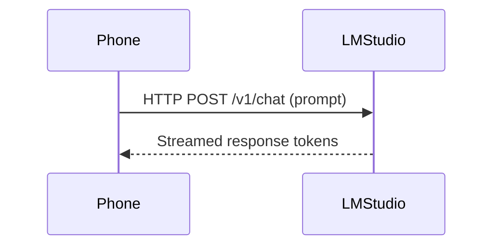
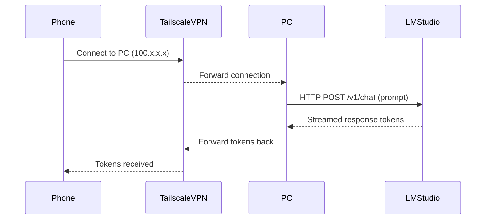

# LocalMesh AI: Feasibility Study

LocalMesh AI is a proposed privacy-first system that lets a user’s mobile device (Android) chat with large language models (LLMs) running on their own PC or server.  All inference stays on user-owned hardware, and communications are end-to-end encrypted.  In local mode, the phone and PC communicate directly over the same LAN; in remote mode, a secure tunnel (e.g. WireGuard/VPN or WebRTC) is used so devices never expose open ports.  This report analyzes the project scope, use cases, competitors, architectures, orchestration, optimization, security, UI, tooling, roadmap, and risks in detail.

## Project Scope and Goals  
- **Scope**: Build an Android client and backend system allowing mobile chat interfaces to use LLMs hosted on a user’s personal computer.  The system must work on a local network and over the Internet without paid cloud services.  
- **Goals**: Ensure *privacy* (no cloud logging of chat or data) and *performance* (leveraging powerful desktop GPUs), provide smooth *mobile UX*, and use only free/open-source tools.  Key features include device discovery, model registry, streaming chat, and both LAN and WAN connectivity.  
- **Technical Focus**: Integrate an LLM server (like LM Studio or Ollama) on the PC with an Android app (using Kotlin/Jetpack Compose) that connects via REST/WebSocket APIs.  Support efficient inference (quantization, batching, streaming) and secure channels (VPN/E2EE, permission keys).  

## Target Users and Use-Cases  
- **Privacy-conscious AI users**: Individuals or businesses who want ChatGPT-like capabilities without sending data to commercial clouds, keeping everything on-premise.  
- **Developers and Hobbyists**: People running local models (LLaMA/GPT-J/etc.) who want mobile chat or integration with local tools (code, note-taking, data analysis).  
- **Mobile-first scenarios**: Use cases like on-the-go queries, voice assistants, or AR apps where the phone is a front-end but heavy AI runs on a desktop.  For example, a research assistant or study buddy that uses large PC models via the phone (heavy model on PC, phone is UI).  
- **Home or SMB setups**: Small teams or home offices self-hosting AI (e.g. Qwen, Mistral) who need a mobile interface across the LAN or even from outside (work-from-home) without relying on external servers.  

## Competitive Landscape

Several existing tools provide parts of this functionality. Below is a comparison of representative solutions for local mobile chat:

| Project / App      | Platforms     | LLM Backend           | Local / Remote Access      | Open Source | Price                |
|-------------------|---------------|-----------------------|----------------------------|-------------|----------------------|
| **LM Studio / LM Link / Locally** | Desktop (Win/macOS/Linux); iOS app | LM Studio (local API) | LAN and remote via Tailscale (LM Link) | No       | Free for personal (preview) |
| **LMSA (Local Model Smart Assistant)** | Android      | LM Studio, Ollama, (or cloud via OpenRouter) | LAN (auto-discovery) and remote via Tailscale | No (proprietary) | Free core, ~$15 one-time unlock |
| **Echo (Udhay-Adithya)** | Android      | Ollama (local)         | LAN only (no cloud)        | Yes (MIT)   | Free (OSS)           |
| **Reins**         | iOS/Android/macOS | Ollama (local)         | LAN and remote (custom P2P) | Yes        | Free                |
| **MyOllama**      | iOS         | Ollama (local)         | LAN only                  | Yes        | Free                |
| **Maid**          | Android      | Ollama (local)         | LAN & remote (Ollama/P2P)  | Yes        | Free (F-Droid)      |
| **Off Grid**      | iOS/Android | On-device + remote     | Hybrid (phone + remote LM) | No         | Paid app           |
| **Open-WebUI** | Web app     | Local LM Studio/Ollama | LAN via browser; remote via tunneling (e.g. Cloudflare) | Yes | Free             |

These tools show that mobile clients for local LLMs exist but often have limitations (e.g. iOS-only, or require manual IP entry).  LM Studio’s *Locally* (iOS) uses a Tailscale-based “LM Link” for secure remote access. LMSA offers Android support with similar VPN-based remote access and LAN auto-discovery. Open-source clients like Reins or Echo connect to Ollama via LAN/P2P. The table and above sources highlight the landscape; LocalMesh AI would need to match or exceed these, e.g. by supporting both Android and iOS (though focus here is Android), LAN auto-discovery, and robust remote connectivity, all with strong privacy guarantees.

## Architecture Options

The system requires bi-directional communication between phone and PC models. Key approaches include:  

- **LAN (Local Network)**: Phone discovers the PC (via mDNS/Bonjour or manual IP) and calls a REST/WebSocket API (e.g. LM Studio’s `/v1/chat`).  This is simplest: only trusted Wi-Fi is needed, and throughput/latency are high.  However, LAN traffic by default is unencrypted on most routers (privacy relies on network isolation).  

- **Tailscale/WireGuard VPN (LM Link style)**: Both devices join a private WireGuard mesh (e.g. using Tailscale).  They then communicate over the secure VPN address (e.g. 100.x.x.x).  This yields end-to-end encryption and avoids port-forwarding.  LM Studio’s LM Link uses exactly this: “All data and communication between devices remain entirely private and secure… on top of custom Tailscale mesh VPNs”. Tailscale has a free tier for personal use.  This approach is recommended for remote (and can also be used on LAN).  

- **WebRTC with STUN/TURN**: Peer-to-peer channels established via WebRTC (UDP) can connect phone and PC.  Requires a signaling server to exchange SDP offers, and possibly a TURN relay for NAT traversal.  Encryption (DTLS-SRTP) is built-in, but setting up TURN (e.g. coturn) can be complex.  This gives direct low-latency links, but uses unfamiliar tech for mobile apps (native WebRTC libraries exist).  

- **Reverse SSH or Tunneling**: Manually forwarding a local port (e.g. `ssh -R 1234:localhost:1234`) or using ngrok/Cloudflare Tunnel.  This opens a route from internet to the PC server.  It works, but is less “privacy by design”: it exposes a public endpoint (though tunneled).  Also requires user setup (SSH keys, ngrok account).  LM Studio documentation advises against unsafe port forwarding and recommends VPNs instead.  

- **Hybrid Relay Server**: A custom cloud service could relay traffic or serve as a rendezvous.  This adds latency and hosting cost (even free-tier may have limits).  It does allow easy connections (like a chat server), but complicates “no cloud” requirement unless ephemeral.  

A comparison table:

| Method                     | LAN Support | Remote Support | Encryption   | Ease of Setup        | Cost          |
|----------------------------|-------------|----------------|--------------|----------------------|---------------|
| **Local Direct (HTTP/Web)**| Yes         | No             | None (LAN)   | Very easy            | Free (local)  |
| **Tailscale/WireGuard**    | Yes         | Yes            | E2E (WireGuard)| Easy (free personal VPN) | Free (personal tier) |
| **WebRTC (P2P)**           | Yes         | Yes            | E2E (DTLS)   | Medium (need STUN/TURN + signaling) | Mostly free software |
| **Reverse SSH / Ngrok**    | Yes         | Yes            | E2E (SSH/TLS)| Moderate (key management) | Free (basic) |
| **Cloud Relay Server**     | Yes         | Yes            | TLS          | Hard (deploy server) | Some hosting (free tiers) |
| **LM Link (Tailscale)** | Yes | Yes | E2E (WireGuard) | Easy (LM Studio integration) | Free (preview) / Paid |

Given no paid cloud budget, **Tailscale/WireGuard** (as used by LM Link) is the recommended remote solution.  It provides secure, NAT-traversal VPN with a free tier.  For LAN, a simple HTTP/streaming API over Wi-Fi suffices (the server must listen on 0.0.0.0 or similar). 

 *Illustration: two mobile devices communicating through a private link. In practice, LocalMesh AI would use a mesh VPN (e.g. Tailscale/WireGuard) or secure P2P to connect phone and PC for LLM inference.*  

## Backend Components and Flows

**Components:** A minimal backend could include: 
- **Device Registry/Pairing**: Stores user devices, handles linking.  Could be a simple service using OAuth (e.g. Google Sign-In) for identity, or manual pairing with QR codes/one-time codes.  This is only for identifying devices; no chat data should be stored centrally.  
- **Signaling Service (for WebRTC, optional)**: If P2P is used, a lightweight server (could be Firebase RTDB, or a small FastAPI/gRPC server) mediates the initial handshake.  If using Tailscale, this isn’t needed.  
- **LLM Server (PC)**: LM Studio or Ollama (or llama.cpp/vLLM) runs on the PC, exposing an OpenAI-compatible REST API (e.g. `/v1/chat`).  This is the core inference service.  
- **Relay (optional)**: If a relay/tunnel service is used (e.g. coturn for WebRTC, or an SSH tunnel), that would also run.  
- **Telemetry/Logging (optional)**: Only non-sensitive logs (performance metrics).  Chats themselves stay local.  

**LAN Flow:**  In LAN mode, the phone discovers the PC (e.g. via mDNS) or user enters IP:Port.  It then calls the LLM server directly over HTTP/WebSocket.  A typical chat flow: phone sends a prompt as JSON to `/v1/chat`, the server streams back token-by-token.  No external server is involved.  



**Remote Flow (Tailscale/VPN):**  Both devices join the user’s private Tailscale network. The phone connects to the PC’s Tailscale IP (100.x.x.x) and issues the same HTTP request.  WireGuard ensures E2EE.  LM Studio’s docs note that *“Your devices are never exposed to the public internet, because LM Link runs on top of custom Tailscale mesh VPNs”*.  The data path remains: Phone → VPN → PC → LM Studio → PC → VPN → Phone.



**Device Pairing/Signaling (if used):** For WebRTC or any peer connection, a short handshake uses a server:  
```mermaid
sequenceDiagram
    participant Phone
    participant Signaler
    participant PC
    Phone->>Signaler: "Need connect to PC"
    PC->>Signaler: "Yes, here is my address"
    Signaler->>Phone: Send PC's info
    Phone->>PC: Direct (WebRTC) handshake
    Phone<->PC: Direct data channel established
```
In practice with Tailscale, this signaling step is replaced by the VPN authentication.  All flows after connection just treat the remote model as “local” (LM Studio automatically handles any model on either device as if local).

## Model Orchestration

The system should manage available models and routing:  
- **Capability Registry:** The PC’s LLM server lists all installed models (LM Studio’s API shows models). The Android app can query this list (e.g. via `/v1/models`) and allow the user to select which model to load or use.  LMSA shows such model lists.  
- **Model Loading:** When the user picks a model, the app can instruct LM Studio to load it via its API or LM Studio CLI.  Only one model may run at a time on the PC if resources are limited.  Tools like LM Studio and Ollama automatically handle unloading/loading.  
- **Routing:** If multiple PCs/servers are linked, the app could choose which one to query for each model, potentially balancing load.  E.g., small models on a laptop, big models on a GPU server.  In practice, we can show separate “devices” with their models (LM Link works this way).  
- **Streaming Inference:** Use the server’s streaming API so the Android UI can display tokens as they arrive (like chatGPT).  LM Studio’s `/v1/chat` is stateful and supports streaming responses.  The app should append tokens to the chat as they come, ensuring responsive UX.  
- **Batching & Concurrency:** LM Studio’s backend (llama.cpp 2.0) supports concurrent requests with *continuous batching*.  This means if the phone (or multiple clients) send multiple chat requests, the server can batch them together on the GPU for efficiency.  We should configure “max concurrent predictions” and KV cache to allow some concurrency if needed.  
- **Multimodal Support:** If desired, the same infrastructure can support images/audio.  For example, the phone could send an image (or audio) to the server, which passes it to a vision model (like a CLIP/Whisper-based pipeline).  This requires endpoint support on the PC side (not standard in LM Studio).  Initially, text-only is easiest; multimodal could be an extension (e.g. using OpenAI-style APIs `/v1/images/generate`).  

## Performance & Optimization

To achieve good performance on commodity hardware, employ these techniques:  
- **Quantization:** Use 4-bit or 8-bit quantized models (e.g. llama.cpp GGUF int4) to reduce memory and increase speed.  For instance, LMSA suggests “lightweight 7B/8B at 4-bit keeps latency down” for live voice chat.  
- **Batching:** As mentioned, enable continuous batching of tokens on the server to fully utilize GPU throughput.  For example, if the mobile app sends tokens one by one, batching can still run them in GPU-parallel.  Also, setting a reasonable *max concurrent predictions* allows overlapping requests without blocking.  
- **Streaming Token Pipes:** The Android app should display tokens as soon as they arrive (SSE/WebSockets) so the user sees immediate response.  Minimize any client-side delay (update the UI on each token chunk).  
- **Caching & Reuse:** For repeated queries (like using the same system prompt), one could cache embeddings or partial outputs, though typical chat usage makes caching less effective.  However, pre-tokenization of prompts on the client can save time (send raw text vs encoded tokens).  
- **Model Selection Heuristics:** The app can pick smaller models for short, interactive queries and larger ones for heavy-duty tasks.  For example, use a 7B for quick answers and a 70B for deep reasoning.  This can be based on user choice or automatic (e.g. if prompt is long or marked “advanced”).  
- **Latency Budgets:** Aim for low *time-to-first-token* on the app.  Monitor metrics (tokens/sec, response time) and if too slow, consider switching to a faster model or reducing context.  The LM Studio API returns token timing stats which can be logged for optimization.  

## Security and Privacy Design

LocalMesh AI must be secure by design:  

- **End-to-End Encryption:** Use TLS or VPN: with Tailscale/WireGuard all traffic is E2E-encrypted.  If WebRTC is used, DTLS-SRTP secures it.  Never send chat contents through an untrusted server.  
- **Authentication and Pairing:** Implement strong device auth.  One approach is OAuth2 (Google Sign-In) solely to identify the user/device without storing chats.  Alternatively, have the user scan a QR or enter a code from the PC app to pair the phone (LM Studio’s `lms login` and `lms link enable` use a similar concept).  The phone should trust only servers it has paired with.  
- **Access Control (Permission Keys):** LM Studio supports API permission keys.  We should use similar tokens so the app can only call the server if it has the key.  This prevents arbitrary apps on the network from using your PC’s LLM.  Keys can be rotated or revoked in the server settings.  
- **No Data Leakage:** By design, no chat transcripts leave the LAN/VPN.  All processing is local.  Even telemetry or logs should omit sensitive content.  LM Studio confirms that prompts and inferences are *“never seen… by the backend service”*.  Ensure any optional cloud features (e.g. web search) are clearly opt-in and use privacy-preserving APIs (Brave Search or anonymizing proxies).  
- **Threat Model:** We assume the user’s devices (phone/PC) are trusted.  The main threats are network attackers or misconfiguration.  Mitigations include: do not forward router ports (use VPN instead), use strong Wi-Fi passwords, and require MFA or key approval on new device links.  Since the phone stores chat history, encrypt it on-device (AES-256).  If a device is lost, one can revoke its key or remove it from the device registry, cutting off access.  

## Android Frontend / UI/UX

Implement the Android app with Kotlin and Jetpack Compose for a modern UI. Key patterns:  
- **Discovery & Connection UI:** On first launch, show a screen to find a local server.  Use mDNS to auto-scan the LAN and list discovered LM Studio/Ollama endpoints with one-tap connect.  Also provide manual entry of IP:port for fallback.  After connecting, require a permission key or pairing code.  
- **Model/Device Selection:** If multiple linked PCs exist, show each as a tab or in a menu.  In each, list available models (queried via `/v1/models`).  Allow the user to select or switch the model; loading a model triggers the PC to load it (LMSA can even load models remotely).  
- **Streaming Chat UI:** Classic chat interface with message bubbles.  Show user messages and bot responses token-by-token or by sentence.  Implement WebSocket/SSE so tokens append live.  Use Compose to scroll the chat as new text arrives.  Include indicators (typing spinner, network status).  
- **Voice Mode (Optional):** Provide a mic button to enable voice chat.  Transcribe speech on-device, send text to model, and read aloud the response.  LMSA’s voice mode is an example: it captures audio, does on-device STT/TTS, and streams chat.  Support continuous listening if needed.  
- **Offline Handling:** Detect connectivity.  If the phone loses connection to the PC (LAN or VPN), show a “disconnected” status and retry logic.  Offline mode (same-WiFi with no internet) should still work for local LLM.  If fully offline (no Wi-Fi), optionally allow running very small on-device models (though outside scope here).  
- **Notifications:** Optionally notify the user of important events (e.g. server online, new message while backgrounded).  Use Android notifications if the app is backgrounded during a chat.  
- **Security UI:** Expose settings to manage paired devices, generate permission keys, sign-in accounts (if using OAuth).  Show that data is encrypted and local.  

## DevOps, Deployment, and Tools

All chosen tools should be free/open-source and self-hosted:  
- **LLM Serving:** Use **LM Studio** (free for personal use) or **Ollama** (open-source) on the PC.  Both support a local REST API.  For maximum performance, consider **vLLM** (for clustered serving) or **llama.cpp** (for on-CPU/GPU).  As LMSA docs note, you can run *“LM Studio, Ollama, llama.cpp, or vLLM on your desktop”* to handle AI compute locally.  Load models in GGUF or compatible format.  
- **Backend Framework:** A lightweight Python or Go service (e.g. FastAPI or Flask) could implement device registry and signaling if needed.  FastAPI is open-source and easy to deploy.  For WebRTC signaling, `aiortc` or Node.js libraries can be used.  
- **Database:** Use PostgreSQL or SQLite for storing user/device metadata.  Postgres can be self-hosted; SQLite can suffice if user count is one.  
- **Networking:** **Tailscale** (free for personal) or **WireGuard** for mesh VPN.  If WebRTC is chosen, use an open-source STUN/TURN server (Coturn) to relay as needed.  
- **Android:** Jetpack Compose UI with Coroutines for networking.  Use OkHttp/WebSocket or Android’s built-in WebSockets.  Data (chats, settings) can be stored encrypted (see SQLCipher or Jetpack Security).  For STT/TTS (if implementing voice), use Android’s SpeechRecognizer and TextToSpeech APIs.  
- **Testing:** Unit-test the Android app using JUnit and Compose testing.  For backend, use pytest or Go tests.  Integration tests can simulate a local LM Studio instance.  Use continuous integration (e.g. GitHub Actions, which is free for public repos) to auto-run tests.  
- **Monitoring:** Since there’s no cloud, keep logs locally or use a tool like Prometheus/Grafana on a management PC to track performance (tokens/sec, latency).  LM Studio provides stats per response which can be logged.  
- **Deployment:** The system is self-hosted.  Provide Docker containers for the pairing/signaling service if used.  For distribution, publish the Android app on F-Droid (free) and/or Google Play.  No paid cloud services are needed – Tailscale and required services have free tiers suitable for a single-user setup.

## Implementation Roadmap

A phased approach (one developer full-time, person-months (PM) estimated):  

| Phase           | Features                                | Est. Effort (PM) | MVP?  |
|-----------------|-----------------------------------------|------------------|-------|
| **1. Core LAN MVP**   | Android app + LM Studio connectivity over Wi-Fi. Chat UI, prompts via HTTP, token streaming. Auto-discovery or manual IP. Basic auth (API key).  | ~2–3 PM      | ✓ Yes |
| **2. Model & Settings UI** | Model selection list, chat history saving, on-device encryption, settings screen, permission keys. | ~1 PM      | ✓ Yes |
| **3. Remote Access (VPN)** | Integrate Tailscale (or WireGuard) support. Allow entering Tailscale IP or automating login.  Handle key/token via VPN. | ~2 PM      | Partial (Optional MVP) |
| **4. Optimizations**   | Implement batching/parallel in server (config LM Studio), quantization instructions, latency logging. Performance tuning.  | ~1–2 PM      | No    |
| **5. Security Hardening** | Penetration testing, add encryption (HTTPS), key rotation UI, revoke device feature, threat-model reviews. | ~1–2 PM      | No    |
| **6. Voice/Multimodal (Opt.)** | Add voice input mode (STT/TTS) and/or image sending if needed. Advanced features.  | ~2 PM      | No    |

This totals roughly 7–10 person-months for a polished product.  The Minimal Viable Product (MVP) would be a LAN-only chat app (phases 1–2).  Remote access can be an advanced MVP feature.  These estimates assume familiarity with Android and local LLM tooling; a team could accelerate timelines.  

## Risks, Privacy, and Compliance

- **Model Licensing:** Ensure all models used are licensed for local use.  Some frontier models may restrict commercial deployment.  Stick to open models (LLaMA3, Qwen, Mistral) to avoid license violations.  
- **Data Privacy:** No chat data should escape user control.  Adhere to privacy principles: data-at-rest encryption (chat logs on phone) and no analytics.  Compliance with regulations (GDPR, HIPAA) depends on the user’s domain; the app should avoid collecting any personal info or PII.  
- **Security:** If device credentials or keys leak, an attacker could misuse your hardware. Mitigation: allow revoking paired devices, rotating keys, and require user confirmation for new links.  Use strong crypto libraries (TLS 1.3, libsodium).  
- **Performance Edge-Cases:** Large context or multiple users could exhaust PC memory.  Mitigation: enforce token limits, allow only one chat at a time by default.  Monitor GPU usage and fail gracefully if OOM.  
- **Connectivity:** Dependence on third-party services (Tailscale) means relying on their availability. However, local LAN mode works offline.  A bug in LM Studio or OS could break compatibility – keep versions updated.  
- **Legal:** If using Google Sign-In or any cloud API, ensure compliance with their terms (though in our plan Google is used only for identity).  Display appropriate disclaimers (as LMSA does).  

## Open Questions

- **Signaling Server**: Can we eliminate any cloud component entirely?  With Tailscale, no signaling server is needed.  But if using pure P2P, where host the STUN/TURN?  (Coturn can run on home PC.)  
- **Multi-device Concurrency**: If multiple phones or desktops connect, how to schedule the GPU?  (LM Studio handles one model at a time; true multi-GPU setups are experimental.)  
- **Energy/Battery**: Continuous chat streaming may drain phone battery.  Need efficient design (batch replies, allow “end-of-conversation” to sleep).  
- **User Experience**: Will non-technical users find pairing easy?  More user testing needed.  

**In summary**, building LocalMesh AI is feasible with current open tools.  A recommended stack is LM Studio or Ollama on the PC, an Android client using Kotlin/Jetpack Compose, and a Tailscale/WireGuard VPN for remote access.  Performance can be optimized via quantization and batching.  Security is ensured through device pairing, E2EE channels, and local-only data.  This aligns with existing systems like LM Studio’s Locally/LM Link and LMSA but extends support to Android and emphasizes fully open-source, no-cost infrastructure. 

**Sources:** Primary documentation and blogs from LM Studio, LMSA, and Tailscale were used (see citations) to ensure accuracy.